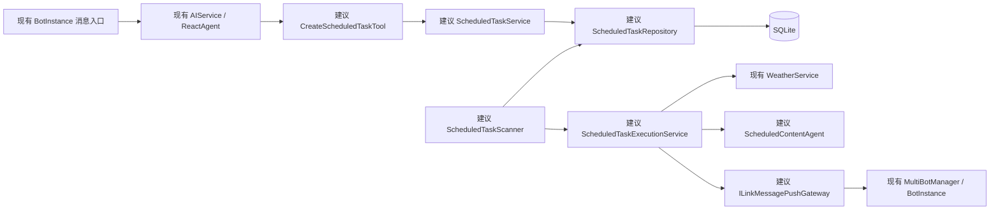

# 当前架构与周期推送目标架构

本文基于仓库根目录当前源码编写。未实现的周期推送组件一律标注为“建议类名”或“建议方法名”，不得把目标设计误认为现有代码。

## 1. 项目概览

当前项目是单 Maven 模块 Spring Boot 微信 AI Bot。它通过 iLink SDK 完成微信登录、消息轮询、媒体下载和回复，通过 Spring AI Alibaba `ReactAgent` 调用 DashScope 模型，并把天气、时间、图片生成、语音合成、联网搜索和邮件发送注册为 Agent Tool。

主要功能：

- 微信扫码登录和会话状态管理。
- 文本、图片、语音消息接收。
- ReactAgent 对话和自动 Tool Calling。
- Open-Meteo 天气查询。
- 图片识别与生成。
- SILK/PCM、ASR 和 TTS 处理。
- 文本、图片和 MP3 文件发送。
- 多 Bot 实例管理和人工回复。
- Agent checkpoint 和向量记忆；另有 JSON 文件记忆组件，但当前 `AIService` 不写入该组件。
- 管理页面、健康检查和天气 REST API。

主要技术：

- Java 21、Spring Boot 3.4.5
- Spring MVC、Thymeleaf、Spring JDBC
- Spring AI Alibaba 1.1.2.3、Spring AI 1.1.8
- DashScope、ReactAgent、Spring AI `@Tool`
- iLink SDK 1.0.1
- SQLite JDBC 3.46.1.0；当前 POM 只有 SQLite 驱动，但跟踪的默认配置仍指向 MySQL
- OkHttp、Caffeine、Jackson、Gson
- JUnit 5、Mockito、MockWebServer

## 2. 目录与模块结构

```text
.
├── pom.xml
├── mvnw / mvnw.cmd
├── src
│   ├── main
│   │   ├── java/com/demo/demo
│   │   │   ├── DemoApplication.java
│   │   │   ├── config/
│   │   │   ├── controller/
│   │   │   ├── execption/
│   │   │   ├── Service/
│   │   │   │   ├── context/
│   │   │   │   ├── memory/
│   │   │   │   ├── throttle/
│   │   │   │   ├── tool/
│   │   │   │   ├── voice/
│   │   │   │   └── weather/
│   │   │   └── Utils/
│   │   └── resources
│   │       ├── application.yml
│   │       ├── application-local.example.yml
│   │       └── templates/
│   └── test/java/
├── docs/
├── weather-cli/
├── others/
└── xialingying/
```

边界说明：

- 根目录 `pom.xml` 的主类是 `com.demo.demo.DemoApplication`，当前主工程源码位于根目录 `src/`。
- `weather-cli/` 有独立 `pom.xml`，不是根 Spring Boot 工程的子模块。
- `others/` 是旧代码。
- 嵌套 `xialingying/` 包含重复工程副本，不在根目录 Maven 默认源码路径中。

当前 Spring 包职责：

| 包 | 职责 |
|---|---|
| `com.demo.demo.controller` | HTTP 页面、管理、健康和天气接口 |
| `com.demo.demo.Service` | Bot、Agent、媒体、邮件和外部服务编排 |
| `com.demo.demo.Service.tool` | ReactAgent Tool Adapter |
| `com.demo.demo.Service.weather` | 天气领域和 Provider |
| `com.demo.demo.Service.voice` | 音频编解码、ASR、TTS |
| `com.demo.demo.Service.memory` | checkpoint 之外的文件和向量记忆增强 |
| `com.demo.demo.Service.context` | 感知上下文构建 |
| `com.demo.demo.Service.throttle` | 用户级限流 |
| `com.demo.demo.config` | 配置属性 |
| `com.demo.demo.execption` | 统一异常响应 |

## 3. 核心类清单

### 3.1 启动、Controller 与配置

| 文件路径 | 类名 | 关键方法 | 当前职责 |
|---|---|---|---|
| `src/main/java/com/demo/demo/DemoApplication.java` | `DemoApplication` | `main(String[])`, `onReady()` | Spring Boot 启动入口 |
| `src/main/java/com/demo/demo/controller/BotController.java` | `BotController` | `initAutoReply()`, `status(String)`, `messages(String)`, `send(String,String,String)` | 装配多 Bot 自动回复 Handler，并提供管理页面接口 |
| `src/main/java/com/demo/demo/controller/MultiBotController.java` | `MultiBotController` | `createInstance(String)`, `getBotStatus(String)`, `sendMessage(String,String,String)` | 另一组多 Bot 管理接口，与 `BotController` 有重叠 |
| `src/main/java/com/demo/demo/controller/BotHealthController.java` | `BotHealthController` | `liveness()`, `readiness()`, `health()`, `metrics()`, `allBotsHealth()` | 健康和运行指标 |
| `src/main/java/com/demo/demo/controller/WeatherController.java` | `WeatherController` | `getWeather(String,String)`, `getWeatherByPath(String,String)`, `batchQuery(WeatherBatchRequest)` | 天气 REST Adapter |
| `src/main/java/com/demo/demo/controller/BotAdminAuthConfig.java` | `BotAdminAuthConfig` | `addInterceptors(InterceptorRegistry)` | Bot 管理接口拦截鉴权 |
| `src/main/java/com/demo/demo/config/VoiceProperties.java` | `VoiceProperties` | `getAsr()`, `getTts()`, `getAudio()` | 绑定 `ai.voice` |
| `src/main/java/com/demo/demo/config/MailProperties.java` | `MailProperties` | Lombok 生成访问方法 | 绑定 `spring.mail` |
| `src/main/java/com/demo/demo/Service/weather/WeatherConfiguration.java` | `WeatherConfiguration` | `weatherClock()`, `weatherHttpClient(WeatherProperties)` | 天气模块基础 Bean |
| `src/main/java/com/demo/demo/Service/weather/WeatherProperties.java` | `WeatherProperties` | 属性访问方法 | 绑定 `weather` 配置 |

### 3.2 iLink、Bot 与消息服务

| 文件路径 | 类名 | 关键方法 | 当前职责 |
|---|---|---|---|
| `src/main/java/com/demo/demo/Service/BotService.java` | `BotService` | `startLogin()`, `startListening()`, `processTextMessage(...)`, `runAutoReply(...)`, `sendReply(...)`, `sendImageReply(...)`, `sendVoiceReply(...)` | Spring 单例旧单 Bot 实现；管理登录、轮询、去重、线程池和发送 |
| `src/main/java/com/demo/demo/Service/BotInstance.java` | `BotInstance` | `startLogin()`, `startListening()`, `processTextMessage(...)`, `runAutoReply(...)`, `sendReply(...)`, `sendImageReply(...)`, `sendVoiceReply(...)` | 一个独立多 Bot 运行实例 |
| `src/main/java/com/demo/demo/Service/MultiBotManager.java` | `MultiBotManager` | `createBot(String)`, `getBot(String)`, `getDefaultBot()`, `setSharedAutoReply(...)`, `startAllBots()` | 创建和保存多个 `BotInstance`，下发共享 Handler |
| `src/main/java/com/demo/demo/Service/WechatMpService.java` | `WechatMpService` | `uploadVoice(byte[])`, `sendVoiceMessage(...)`, `sendTextMessage(String,String)` | 微信公众号客服 API；当前未接入 iLink 主链路 |
| iLink 外部依赖 | `ILinkClient` | `receiveMessages(...)`, `downloadMedia(...)`, `uploadMedia(...)`, `sendTextMessage(...)`, `sendImageMessage(...)`, `sendVoiceMessage(...)`, `sendFileMessage(...)` | 微信通信 SDK；当前源码的语音回复使用 `sendFileMessage(...)`，未使用 SDK 的 `sendVoiceMessage(...)` |

当前同时存在 `BotService` 与 `BotInstance` 两套高度相似实现。周期推送应以 `MultiBotManager` + `BotInstance` 为目标通道，不应继续扩大重复。

### 3.3 ReactAgent、Tool 与业务 Service

| 文件路径 | 类名 | 关键方法 | 当前职责 |
|---|---|---|---|
| `src/main/java/com/demo/demo/Service/AIService.java` | `AIService` | `init()`, `chat(String,String)`, `doChat(String,String)`, `isConfigured()` | 构建并调用 `ReactAgent`，管理用户级串行和向量记忆写入 |
| `src/main/java/com/demo/demo/Service/memory/MemoryAgentHook.java` | `MemoryAgentHook` | `beforeAgent(OverAllState,RunnableConfig)` | Agent 开始前检索向量记忆 |
| `src/main/java/com/demo/demo/Service/memory/MemoryContextInterceptor.java` | `MemoryContextInterceptor` | `interceptModel(ModelRequest,ModelCallHandler)` | 把检索到的记忆追加到模型 system message |
| `src/main/java/com/demo/demo/Service/context/ContextManager.java` | `ContextManager` | `buildEnhancedSystemMessage(...)`, `recordImage(...)`, `recordVoice(...)` | 保存和构建感知上下文 |
| `src/main/java/com/demo/demo/Service/tool/WeatherTool.java` | `WeatherTool` | `queryWeather(String,String)` | 将 Tool 参数转换为 `WeatherQuery` |
| `src/main/java/com/demo/demo/Service/tool/TimeTool.java` | `TimeTool` | `getCurrentTime()` | 返回当前日期时间 |
| `src/main/java/com/demo/demo/Service/tool/ImageGenerationTool.java` | `ImageGenerationTool` | `generateImage(String)`, `takeLastImage()` | 生成图片并通过 `ThreadLocal` 暂存二进制 |
| `src/main/java/com/demo/demo/Service/tool/VoiceReplyTool.java` | `VoiceReplyTool` | `voiceReply(String)`, `takeLastAudio()` | TTS 并通过 `ThreadLocal` 暂存音频 |
| `src/main/java/com/demo/demo/Service/tool/WebSearchTool.java` | `WebSearchTool` | `search(String)` | 调用百度搜索 API |
| `src/main/java/com/demo/demo/Service/tool/EmailTool.java` | `EmailTool` | `sendEmail(String,String,String)` | 调用 `MailService` 发邮件 |
| `src/main/java/com/demo/demo/Service/weather/WeatherService.java` | `WeatherService` | `query(WeatherQuery)` | 地点解析、日期选择、缓存和天气查询编排 |
| `src/main/java/com/demo/demo/Service/weather/OpenMeteoWeatherProvider.java` | `OpenMeteoWeatherProvider` | `resolveLocation(String)`, `fetch(WeatherLocation)` | 调用 Open-Meteo |
| `src/main/java/com/demo/demo/Service/ImageGenerationService.java` | `ImageGenerationService` | `generateImage(String)` | DashScope 图片生成 |
| `src/main/java/com/demo/demo/Service/ImageRecognitionService.java` | `ImageRecognitionService` | `recognize(byte[])` | 图片识别 |
| `src/main/java/com/demo/demo/Service/MailService.java` | `MailService` | `send(String,String,String)`, `checkRateLimit(String)` | 邮件发送和限流 |

### 3.4 语音

| 文件路径 | 类名 | 关键方法 | 当前职责 |
|---|---|---|---|
| `src/main/java/com/demo/demo/Service/voice/VoiceMessageHandler.java` | `VoiceMessageHandler` | `recognize(String,Supplier<byte[]>)`, `synthesize(String)` | Bot 与语音应用服务之间的 Adapter |
| `src/main/java/com/demo/demo/Service/voice/VoiceMessageService.java` | `VoiceMessageService` | `recognize(String,byte[])`, `synthesizeReply(String)` | SILK 解码、ASR 和 TTS 降级 |
| `src/main/java/com/demo/demo/Service/voice/AudioConverter.java` | `AudioConverter` | `silkToPcm(byte[])`, `pcmToSilk(byte[])` | 外部进程执行 SILK/PCM 转换 |
| `src/main/java/com/demo/demo/Service/voice/SiliconFlowAsrService.java` | `SiliconFlowAsrService` | `transcribe(byte[])` | PCM 包装 WAV 后调用 ASR |
| `src/main/java/com/demo/demo/Service/voice/SiliconFlowTtsService.java` | `SiliconFlowTtsService` | `synthesize(String)` | 使用 DashScope Speech Model 生成音频 |

### 3.5 当前持久化、Repository 与 Entity

| 文件路径 | 类名 | 关键方法 | 当前职责 |
|---|---|---|---|
| `src/main/java/com/demo/demo/Service/memory/VectorMemoryStore.java` | `VectorMemoryStore` | `saveTurn(...)`, `retrieveRelevant(...)`, `countByUser(...)` | 直接使用 `JdbcTemplate` 读写 `vector_memory` |
| `src/main/java/com/demo/demo/Service/memory/ConversationMemoryStore.java` | `ConversationMemoryStore` | `getHistory(String)`, `appendTurn(...)`, `clear(String)` | 使用 JSON 文件保存最近对话 |
| `src/main/java/com/demo/demo/Service/memory/ConversationMessage.java` | `ConversationMessage` | record 访问方法 | 文件记忆的数据记录 |
| 当前不存在 | Repository 层 | 无 | 没有 `Repository` 包或 Spring Data Repository；JDBC 在 `VectorMemoryStore` 内直接执行 |
| 当前不存在 | ORM Entity | 无 | 没有 JPA Entity；天气等模型使用 Java record/普通类 |
| 当前不存在 | 周期任务表和实体 | 无 | 周期推送未实现 |

### 3.6 TASK-003 新增：周期调度领域模型与 Schema（2026-07-28）

| 文件路径 | 类名 | 关键方法 | 当前职责 |
|---|---|---|---|
| `Service/scheduling/domain/ScheduledTaskStatus.java` | `ScheduledTaskStatus` | — | ACTIVE/PAUSED/CANCELED 枚举 |
| `Service/scheduling/domain/ExecutionStatus.java` | `ExecutionStatus` | — | PENDING/RUNNING/SUCCEEDED/FAILED/RETRY 枚举 |
| `Service/scheduling/domain/DeliveryTarget.java` | `DeliveryTarget` | `create(...)`, `withToken(...)` | 推送目标含加密 token |
| `Service/scheduling/domain/ScheduledTask.java` | `ScheduledTask` | `createDailyWeather(...)`, `pause(...)`, `resume(...)`, `cancel(...)`, `advanceNextRun(...)` | 每日天气任务领域对象，含状态转换 |
| `Service/scheduling/domain/TaskExecution.java` | `TaskExecution` | `createPending(...)`, `markRunning(...)`, `markSucceeded(...)`, `markFailed(...)`, `scheduleRetry(...)` | 单次执行记录，含状态机 |
| `Service/scheduling/domain/NextRunCalculator.java` | `NextRunCalculator` | `nextDailyRun(LocalTime,ZoneId,Instant)` | 基于 IANA 时区的下次执行 UTC 时间计算，处理 DST |
| `Service/scheduling/persistence/SchedulingSchemaInitializer.java` | `SchedulingSchemaInitializer` | `init()` | `@PostConstruct` 幂等创建三张表及索引 |

### 3.7 TASK-004 新增：JDBC Repository（2026-07-28）

| 文件路径 | 类名 | 关键方法 | 当前职责 |
|---|---|---|---|
| `persistence/DeliveryTargetRepository.java` | `DeliveryTargetRepository` | `upsert(...)`, `findById(...)` | 推送目标持久化接口 |
| `persistence/JdbcDeliveryTargetRepository.java` | `JdbcDeliveryTargetRepository` | 全部接口方法 + RowMapper | `JdbcTemplate` 实现 |
| `persistence/ScheduledTaskRepository.java` | `ScheduledTaskRepository` | `insert(...)`, `findByOwner(...)`, `findByTaskId(...)`, `updateStatusOwned(...)`, `advanceNextRun(...)`, `findDue(...)` | 任务持久化接口 |
| `persistence/JdbcScheduledTaskRepository.java` | `JdbcScheduledTaskRepository` | 全部接口方法 + RowMapper | `JdbcTemplate` 实现，条件更新含 owner 校验 |
| `persistence/TaskExecutionRepository.java` | `TaskExecutionRepository` | `insertUnique(...)`, `findById(...)` | 执行记录持久化接口 |
| `persistence/JdbcTaskExecutionRepository.java` | `JdbcTaskExecutionRepository` | 全部接口方法 + RowMapper | `JdbcTemplate` 实现，UNIQUE 冲突返回 empty |

## 4. 当前真实调用链

### 4.1 用户文本消息接收链路

多 Bot 主链：

`BotInstance.startListening()`
→ `ILinkClient.receiveMessages(LoginCredentials, cursor)`
→ `BotInstance.markInboundMessageIfNew(messageId, itemMsgId)`
→ `BotInstance.processTextMessage(fromUser, contextToken, text)`
→ `BotInstance.rememberReplyTarget(fromUser, contextToken)`
→ `BotInstance.submitReplyTask(fromUser, contextToken, task)`
→ `BotInstance.runAutoReply(fromUser, contextToken, text)`
→ `BotService.ReplyHandler.onMessage(fromUser, contextToken, text)`

`BotService.ReplyHandler` 的共享实现由 `BotController.initAutoReply()` 中的 lambda 注册：

`BotController.initAutoReply()`
→ `MultiBotManager.setSharedAutoReply(handler)`
→ `BotInstance.setAutoReply(handler)`

旧单 Bot 链路在 `BotService.startListening()` 中重复实现相同流程。

### 4.2 图片消息接收链路

`BotInstance.startListening()`
→ `BotInstance.processImageItem(fromUser, contextToken, ImageContent)`
→ `BotInstance.submitReplyTask(...)`
→ `ILinkClient.downloadMedia(downloadParam, aesKey)`
→ `BotInstance.processImageMessage(fromUser, contextToken, imageBytes)`
→ `BotService.ImageReplyHandler.onImage(...)`

共享图片 Handler 在 `BotController.initAutoReply()` 中调用：

`ImageRecognitionService.recognize(imageBytes)`
→ `ContextManager.recordImage(fromUser, description)`
→ `AIService.chat(fromUser, prompt)`

### 4.3 语音消息接收链路

如果 `VoiceContent.getText()` 有微信识别结果：

`BotInstance.processVoiceMessage(...)`
→ `VoiceContent.getText()`
→ `BotInstance.processTextMessage(...)`

否则：

`BotInstance.processVoiceMessage(...)`
→ `VoiceMessageHandler.recognize(userId, downloader)`
→ `ILinkClient.downloadMedia(encryptQueryParam, aesKey)`
→ `VoiceMessageService.recognize(userId, silkAudio)`
→ `AudioCodecService.silkToPcm(silkAudio)`
→ `AsrService.transcribe(pcm)`
→ `BotService.ReplyHandler.onMessage(...)`

### 4.4 ReactAgent 调用链

`BotController.initAutoReply()` 中的共享文本 lambda
→ `AIService.chat(userId, message)`
→ 同一 `userId` 的 `synchronized` 锁
→ `AIService.doChat(userId, message)`
→ `ContextManager.buildEnhancedSystemMessage(userId, systemPrompt)`
→ `RunnableConfig.builder().threadId(userId).addMetadata(...)`
→ `ReactAgent.call(message, runnableConfig)`
→ `AssistantMessage.getText()`
→ `VectorMemoryStore.saveTurn(userId, message, reply)`

Agent 初始化：

`AIService.init()`
→ `DashScopeApi.builder()`
→ `DashScopeChatModel.builder()`
→ `ReactAgent.builder()`
→ `.saver(MemorySaver)`
→ `.tools(ToolCallbacks.from(...))`
→ `.hooks(trimHook, MemoryAgentHook)`
→ `.interceptors(MemoryContextInterceptor)`
→ `.build()`

当前 `ContextManager.buildEnhancedSystemMessage()` 的结果写入 metadata `system_prompt`，但当前自定义 Interceptor 没有读取该 metadata。框架是否自动使用它，实施前必须通过当前依赖源码或行为测试确认。

### 4.5 Tool 调用链

天气：

`ReactAgent`
→ `WeatherTool.queryWeather(location, date)`
→ `WeatherService.query(new WeatherQuery(location, date))`
→ `WeatherProvider.resolveLocation(location)`
→ `OpenMeteoWeatherProvider.resolveLocation(location)`
→ `WeatherProvider.fetch(location)`
→ `OpenMeteoWeatherProvider.fetch(location)`
→ `WeatherToolResult`

图片：

`ReactAgent`
→ `ImageGenerationTool.generateImage(prompt)`
→ `ImageGenerationService.generateImage(prompt)`
→ `ImageGenerationTool.takeLastImage()`
→ `BotController.initAutoReply()` 中的 lambda
→ `MultiBotManager.getDefaultBot().sendImageReply(...)`

语音：

`ReactAgent`
→ `VoiceReplyTool.voiceReply(text)`
→ `TtsService.synthesize(text)`
→ `VoiceReplyTool.takeLastAudio()`
→ `MultiBotManager.getDefaultBot().sendVoiceReply(...)`

图片和语音 Tool 使用 `ThreadLocal` 传递二进制，并且当前总是通过默认 Bot 发送，存在多 Bot 路由错误风险。

当前共享 `BotService.ReplyHandler.onMessage(fromUser, contextToken, text)` 不包含触发消息的 `BotInstance` 或 `instanceId`。因此 `BotController` 收到 Handler 回调后只知道用户和 token，不能从现有参数恢复来源 Bot；文档不得把稳定 Bot 路由描述成现有能力。

### 4.6 iLink 消息发送链路

文本：

`BotInstance.sendReply(toUserId, contextToken, text)`
→ `ILinkClient.sendTextMessage(credentials, toUserId, contextToken, text)`

图片：

`BotInstance.sendImageReply(toUserId, contextToken, imageBytes)`
→ `ILinkClient.uploadMedia(credentials, 1, toUserId, imageBytes)`
→ `ILinkClient.sendImageMessage(credentials, toUserId, contextToken, media)`

当前语音输出：

`BotInstance.sendVoiceReply(toUserId, contextToken, mp3Audio)`
→ `ILinkClient.uploadMedia(credentials, 3, toUserId, mp3Audio)`
→ `ILinkClient.sendFileMessage(credentials, toUserId, contextToken, media, fileName, length)`

当前发送的是 MP3 文件，不是 `AudioConverter.pcmToSilk()` 后的原生 SILK 语音消息。

### 4.7 数据持久化链路

向量记忆写入：

`AIService.chat(userId, message)`
→ `VectorMemoryStore.saveTurn(userId, userMessage, assistantMessage)`
→ `EmbeddingModel.embed(text)`
→ `VectorMemoryStore.saveOne(...)`
→ `JdbcTemplate.update("INSERT INTO vector_memory ...")`
→ `VectorMemoryStore.pruneUser(userId)`

向量记忆读取：

`MemoryAgentHook.beforeAgent(state, config)`
→ `VectorMemoryStore.retrieveRelevant(userId, query)`
→ `JdbcTemplate.query("SELECT content, embedding FROM vector_memory ...")`
→ `MemoryContextInterceptor.interceptModel(...)`

文件记忆是独立路径：

`ConversationMemoryStore.appendTurn(...)`
→ `ConversationMemoryStore.persistToDisk()`
→ `ai.memory.file`，默认 `./data/conversation-memory.json`

当前 `AIService` 不调用 `ConversationMemoryStore.appendTurn()`。

## 5. 周期推送目标架构

以下均为建议组件，当前源码不存在。



| 建议组件 | 职责 | 依赖 |
|---|---|---|
| `CreateScheduledTaskTool` | 接收模型可见的城市、时间、时区参数，创建每日天气任务 | `ScheduledTaskService`、可信 `ToolContext` |
| `ManageScheduledTaskTool` | 查询、暂停、恢复、取消当前用户任务 | `ScheduledTaskService`、可信 `ToolContext` |
| `ScheduledTask` | 表达任务类型、执行时间、时区、payload、状态和下一次执行时刻 | Java time，无 Spring 依赖 |
| `TaskExecution` | 表达一次计划执行的状态、次数、租约和错误码 | `ScheduledTask` |
| `ScheduledTaskRepository` | SQLite 任务 CRUD、到期扫描、条件状态更新 | `JdbcTemplate` |
| `TaskExecutionRepository` | 唯一执行记录、抢占、重试和恢复 | `JdbcTemplate` |
| `DeliveryTargetRepository` | 保存默认 Bot 范围内的用户和加密 contextToken | `JdbcTemplate` |
| `ScheduledTaskService` | 用户范围内创建、去重、查询和状态变更 | Repository、`NextRunCalculator` |
| `ScheduledTaskScanner` | 固定间隔扫描到期任务，创建执行记录并提交 worker | Repository、执行线程池 |
| `ScheduledTaskExecutionService` | 查询天气、生成文案、发送、更新执行状态 | `WeatherService`、Agent、Gateway、Repository |
| `ScheduledContentAgent` | 使用独立无副作用 ReactAgent 格式化真实天气数据 | `DashScopeChatModel` |
| `ILinkMessagePushGateway` | 解密目标、使用当前默认 Bot 发送并标准化结果 | `DeliveryTargetService`、`MultiBotManager` |
| `ContextTokenCipher` | AES-GCM 加解密 contextToken | 环境密钥 |

推荐使用数据库扫描而不是为每行注册一个内存 `ScheduledFuture`。原因：SQLite 中的任务是事实来源，应用重启后无需重建易失内存状态；唯一执行键和条件更新可以独立测试。

## 6. 周期推送目标调用链

以下方法均以“建议”标识。

### 6.1 创建任务

现有 `BotInstance.processTextMessage(...)`
→ 现有 `BotController.initAutoReply()` 共享 Handler
→ 建议把 `InboundMessageContext` 映射为 `DeliveryTargetRefreshCommand`
→ 建议 `DeliveryTargetService.refresh(DeliveryTargetRefreshCommand)`
→ 建议 `AIService.chat(userId, message, AgentCallerContext)`
→ 现有 `ReactAgent.call(...)`
→ 建议 `CreateScheduledTaskTool.createDailyWeatherTask(location, localTime, timeZone, ToolContext)`
→ 建议 `ScheduledTaskService.createDailyWeatherTask(command)`
→ 建议 `NextRunCalculator.nextDailyRun(...)`
→ 建议 `ScheduledTaskRepository.insert(task)`

`userId` 和 contextToken 不得作为模型参数。contextToken 先加密入库；Tool 只从框架 `ToolContext` 获取不可伪造的 delivery target ID。MVP 明确限定为 `MultiBotManager.getDefaultBot()`；若要求多 Bot 精确路由，必须另行修改 Handler 接口以携带来源 Bot，不能由模型或 userId 猜测。

### 6.2 查询任务

现有 `ReactAgent.call(...)`
→ 建议 `ManageScheduledTaskTool.manage("LIST", null, ToolContext)`
→ 建议 `ScheduledTaskService.listTasks(deliveryTargetId)`
→ 建议 `ScheduledTaskRepository.findByOwner(deliveryTargetId)`

### 6.3 取消任务

现有 `ReactAgent.call(...)`
→ 建议 `ManageScheduledTaskTool.manage("CANCEL", taskKey, ToolContext)`
→ 建议 `ScheduledTaskService.cancel(deliveryTargetId, taskKey)`
→ 建议 `ScheduledTaskRepository.updateStatusOwned(taskKey, deliveryTargetId, CANCELED)`

暂停和恢复使用相同链路；恢复时建议重新计算 `nextRunAt`。

### 6.4 定时触发

建议 `ScheduledTaskScanner.scan()`
→ 建议 `ScheduledTaskRepository.findDue(now, batchSize)`
→ 建议 `TaskExecutionRepository.insertUnique(taskId, scheduledFor)`
→ 建议 `ScheduledTaskRepository.advanceNextRun(taskId, version, nextRun)`
→ 建议 `ScheduledTaskExecutionService.execute(executionId)`

### 6.5 Agent 生成内容

建议 `ScheduledTaskExecutionService.execute(executionId)`
→ 现有 `WeatherService.query(new WeatherQuery(location, "今天"))`
→ 建议 `ScheduledContentAgent.generate(task, weatherReport)`
→ 建议 `WeatherMessageTemplateFormatter.format(weatherReport)`，仅在模型异常或空结果时降级

周期 Agent 不使用普通会话 `MemorySaver`、`MemoryAgentHook` 或 `VectorMemoryStore.saveTurn()`。

### 6.6 iLink 推送

建议 `ScheduledTaskExecutionService.execute(executionId)`
→ 建议 `MessagePushGateway.pushText(pushRequest)`
→ 建议 `DeliveryTargetService.resolve(targetId)`
→ 现有 `MultiBotManager.getDefaultBot()`
→ 现有 `BotInstance.sendReply(toUserId, contextToken, text)` 的可观测适配
→ `ILinkClient.sendTextMessage(...)`

`BotInstance.sendReply()` 当前返回 `void` 并吞掉异常。实施推送适配前必须通过兼容方法或下层发送结果接口提供成功/失败状态，不能直接假定发送成功。

这里的默认 Bot 是明确的 MVP 范围，不是多 Bot 正确路由方案。若人工决定支持任意 Bot，先扩展 `BotService.ReplyHandler`（或新增来源感知接口）传递 `BotInstance`/稳定标识，再设计持久化路由；不得保存当前进程临时生成的 `instanceId` 作为跨重启标识。

## 7. 数据流与上下文隔离

### 7.1 用户身份来源

当前用户身份来自：

- `WeixinMessageDto.getFromUserId()`
- `WeixinMessageDto.getContextToken()`

前两项在 `BotInstance.startListening()` 中读取并沿 `processTextMessage(...)`、`runAutoReply(...)` 传给共享 Handler。接收消息的具体 `BotInstance` 在 Handler 边界丢失；`BotController.initAutoReply()` 的 lambda 参数中没有 Bot 信息。模型不得生成或覆盖用户身份字段。

### 7.2 任务指令传递

用户自然语言原文进入 `AIService.chat()`。ReactAgent 只向周期 Tool 提供业务参数：

- 城市
- 每日执行时间
- 时区
- 管理动作和公开 task key

任务 owner 从服务端构造的可信 `ToolContext` 获得。

### 7.3 调度信息存储

建议 SQLite 保存：

- `wechat_delivery_target`：默认 Bot 范围内的用户和加密 contextToken
- `scheduled_task`：任务类型、时间、时区、payload、状态和 `next_run_at`
- `scheduled_task_execution`：`scheduled_for`、状态、尝试次数、租约和错误码

建议 UTC 时刻使用 `INTEGER` epoch milliseconds，业务时间和 IANA 时区使用 `TEXT`，payload 使用经过服务端校验的 JSON `TEXT`。

### 7.4 Agent 结果到 iLink

`ScheduledContentAgent` 返回纯文本
→ `ScheduledTaskExecutionService` 构造 `PushRequest`
→ `ILinkMessagePushGateway` 获取并解密目标
→ `MultiBotManager.getDefaultBot()`
→ iLink SDK。

Agent 不接触 LoginCredentials 或明文 contextToken。

### 7.5 避免用户上下文串线

- 当前对话使用 `RunnableConfig.threadId(userId)` 和 `AIService.userLocks`。
- 周期任务 owner 使用 delivery target ID，而不是模型参数。
- 周期 Agent 使用执行级 thread ID，不复用用户普通聊天 thread。
- 同一次执行必须绑定固定 task ID、target ID 和 scheduledFor。
- Tool 上下文通过 Spring AI `ToolContext`/Alibaba `ToolInterceptor` 传递，不依赖可能跨线程失效的普通 `ThreadLocal`。
- MVP 仅支持默认 Bot；不得声称已经支持多 Bot 精确路由。若扩展多 Bot，先让入站 Handler 携带来源 Bot，再独立设计稳定标识。

## 8. 风险

### 8.1 重复执行

扫描重复、进程崩溃和发送超时都可能导致重复。数据库必须对 `(task_id, scheduled_for)` 建唯一约束，并通过条件状态更新抢占执行。iLink 若没有幂等键，发送成功但响应丢失仍可能产生极低概率重复。

### 8.2 服务重启

任务和执行必须持久化。`PENDING` 可重新执行；长时间 `RUNNING` 需要租约超时恢复；内存 `ScheduledFuture` 不能作为唯一状态。

### 8.3 并发执行

SQLite 同时只允许有限写并发。应启用 WAL 和 `busy_timeout`，使用短事务，不得在事务中调用天气、Agent 或 iLink。

### 8.4 任务时区

必须同时保存 `LocalTime` 和 IANA `ZoneId`，并把 `next_run_at` 保存为 UTC。不得只依赖服务器时区或固定 `+08:00`。

### 8.5 Cron 解析

MVP 不接受任意 Cron。模型只输出 `HH:mm` 和时区，服务端创建 `DAILY` recurrence。这样避免错误 Cron、秒字段差异和注入问题。

### 8.6 用户上下文隔离

当前 `threadId` 只有 userId，多 Bot 同用户是否应共享记忆未明确。MVP 仅支持默认 Bot，周期任务按 delivery target 隔离，且不能把 contextToken 放入 Agent prompt 或 metadata。

### 8.7 Agent 执行超时

周期内容 Agent 必须设置超时、限制长度，并在异常或空结果时使用确定性天气模板。天气查询失败时禁止让模型自行生成天气。

### 8.8 iLink 发送失败

当前 `sendReply()` 无返回值。目标适配器需要区分 Bot 离线、目标失效、限流和 SDK 异常。contextToken 能否跨日主动使用必须通过真机验证。

### 8.9 重试与幂等

只重试可恢复错误，限制最大次数和退避时间。目标明确失效时终止重试。执行日志只保存错误码和时间，不保存完整消息正文或敏感响应。

### 8.10 数据库迁移

当前 POM 只有 SQLite JDBC，用户也说明运行环境为 SQLite，但跟踪的 `application.yml` 仍配置 MySQL URL 和驱动类；默认配置与依赖并不自洽。创建周期表前必须确认有效 datasource、SQLite 文件位置和现有建表入口。周期功能应复用当前 `JdbcTemplate`/`DataSource`，不得顺带改写全局 datasource。SQLite DDL 不能使用 MySQL `JSON`、`DATETIME`、`SKIP LOCKED` 等语法。

### 8.11 当前双 Bot 实现

`BotService` 和 `BotInstance` 重复。周期推送若同时接入两套实现会扩大维护成本。目标架构应选 `MultiBotManager` + `BotInstance`，旧 `BotService` 只保留兼容，不在本功能中整体重构。

### 8.12 多 Bot 路由边界

当前共享文本 Handler 不携带来源 Bot，Tool 生成图片和语音后也调用 `MultiBotManager.getDefaultBot()`。周期推送 MVP 应显式限定默认 Bot，避免在本功能中引入稳定 Bot 注册、跨重启映射和两套 Bot 实现重构。若产品要求多 Bot 精确推送，应单独立项并先修改入站接口。

## 9. 仍需源码或运行环境确认

- 有效 `application-local.yml` 是否把 datasource 覆盖为 SQLite、SQLite 文件路径是什么。
- `vector_memory` 表当前由谁创建。
- iLink `contextToken` 是否支持跨日主动推送、重新登录后是否继续有效。
- iLink SDK 是否提供可用于主动发送的稳定会话或幂等标识。
- 周期推送 MVP 是否确认只支持默认 Bot；若否，需另立多 Bot 来源传递与稳定路由 Task。
- 用户未给出城市或时区时，是要求 Agent 追问，还是使用产品默认值。
- `RunnableConfig` 的 `system_prompt` metadata 是否被当前 ReactAgent 版本自动消费。

## 10. TASK-002 代码审计确认清单

以下结论来自 2026-07-28 对根目录源码的只读审计：

| 检查项 | 结论 | 证据 |
|--------|------|------|
| POM 数据库驱动 | 仅 `sqlite-jdbc 3.46.1.0`，无 MySQL Connector/J | `pom.xml` L179-183 |
| 跟踪的 application.yml datasource | MySQL URL + `com.mysql.cj.jdbc.Driver` | `application.yml` L15-20 |
| 本地 application-local.yml datasource | gitignored，内容也是 MySQL URL | `application-local.yml` L9-10 |
| profile 配置 | `spring.profiles.active: local` | `application.yml` L22-23 |
| `*.sql` schema 文件 | 项目内 0 个 | 全局搜索 |
| Java 代码中 `CREATE TABLE` | 0 处 | 全局搜索 |
| `DataSourceInitializer` Bean | 不存在 | 全局搜索 |
| `spring.sql.init.*` 配置 | 不存在 | yml 搜索 |
| `VectorMemoryStore` 建表 | 无 — 直接 INSERT/SELECT/DELETE | `VectorMemoryStore.java` |
| `@EnableScheduling` | 不存在 | 全局搜索 |
| `@PostConstruct` 顺序风险 | 已验证无影响 — `MultiBotManager.createBot()` 通过 `applySharedHandlers()` 兜底 | `MultiBotManager.java` L46-56, L176-186 |
| 编译 | BUILD SUCCESS | `mvnw.cmd -DskipTests compile` |
| git diff --check | 干净 | 无输出 |

### 结论

1. **datasource 冲突未解决**：POM 只有 SQLite 驱动但全部 yml 配置均为 MySQL。用户声称运行时使用 SQLite，需在启动日志中确认实际 JDBC URL 和驱动类名。
2. **建表入口缺失**：`vector_memory` 表无代码化创建机制，推测为手动创建。TASK-003 的 schema 初始化需自建机制，不能复用现有入口。
3. **调度基础设施空白**：无 `@EnableScheduling`、无调度器、无执行表。TASK-008 需要完整新建。
4. **iLink 推送门禁**：`contextToken` 跨日/重登行为待手动测试；`sendReply()` 返回 void 且吞异常，TASK-010 需新增可观测发送方法。
