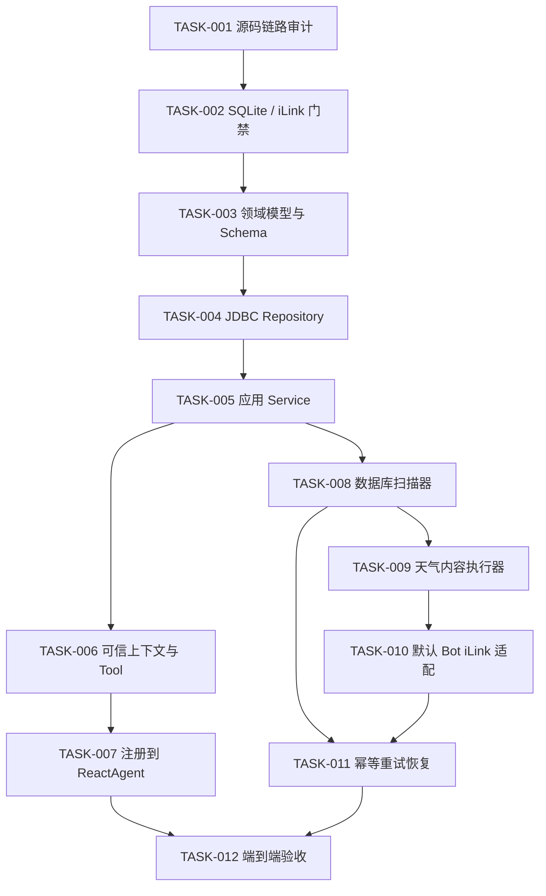

# 周期性消息推送开发任务清单

本文只描述尚未实现的周期推送功能。除明确标注“现有”的类和方法外，类名与方法名均为建议设计，实施前仍须按 `CLAUDE.md` 搜索源码确认。

目标链路：

`用户输入`
→ `现有 AIService / ReactAgent`
→ `建议周期任务 Tool`
→ `SQLite`
→ `建议数据库扫描调度器`
→ `建议 ScheduledContentAgent`
→ `现有 iLink 发送能力`

MVP 边界：

- 只支持“每天某个本地时间发送指定城市天气”，不接受任意 Cron。
- 只支持 `MultiBotManager.getDefaultBot()`。当前共享 Handler 不携带来源 Bot，多 Bot 精确推送另行立项。
- 周期表复用当前 Spring `DataSource`/`JdbcTemplate`；不得在本功能中顺带改写全局 datasource。
- 不引入分布式锁、消息队列、微服务、健康管理端点或通用工作流平台。

## TASK-001：确认现有 Agent 和消息发送链路

- [x] 已完成

### 目标

以根目录实际源码为依据，确认文本接收、ReactAgent、Tool、iLink 发送、用户身份和 JDBC 持久化基线。

### 前置依赖

- 无

### 涉及的现有文件

- `src/main/java/com/demo/demo/Service/AIService.java`
- `src/main/java/com/demo/demo/controller/BotController.java`
- `src/main/java/com/demo/demo/Service/BotInstance.java`
- `src/main/java/com/demo/demo/Service/BotService.java`
- `src/main/java/com/demo/demo/Service/MultiBotManager.java`
- `src/main/java/com/demo/demo/Service/tool/WeatherTool.java`
- `src/main/java/com/demo/demo/Service/memory/VectorMemoryStore.java`
- `src/main/java/com/demo/demo/Service/context/ContextManager.java`
- `pom.xml`
- `src/main/resources/application.yml`

### 预计新增文件

- 无

### 预计修改类

- 无；本 Task 是只读审计。

### 预计新增或修改方法

| 类名 | 方法及签名 | 返回值 | 调用方 | 被调用方 | 性质 |
|---|---|---|---|---|---|
| `BotInstance` | `void processTextMessage(String fromUser, String contextToken, String text)` | `void` | `startListening()` | `submitReplyTask(...)` | 现有、包可见 |
| `BotController` | `public void initAutoReply()` | `void` | `@PostConstruct` | `MultiBotManager.setSharedAutoReply(...)` | 现有 |
| `AIService` | `public String chat(String userId, String message)` | `String` | `BotController` lambda | `doChat(...)` | 现有 |
| `AIService` | `private String doChat(String userId, String message)` | `String` | `chat(...)` | `ReactAgent.call(String,RunnableConfig)` | 现有 |
| `BotInstance` | `public void sendReply(String toUserId, String contextToken, String text)` | `void` | `runAutoReply(...)` | `ILinkClient.sendTextMessage(...)` | 现有 |

### 具体实现步骤

1. 用 `rg` 核对根目录源码，不把 `others/` 或嵌套 `xialingying/` 当作主工程。
2. 记录 `AIService.init()` 中 `ReactAgent.builder()` 和 `ToolCallbacks.from(...)` 的真实参数。
3. 记录 `WeixinMessageDto.getFromUserId()`、`getContextToken()` 的读取和传递位置。
4. 记录文本、图片、语音实际 iLink API。
5. 记录当前 JDBC 使用方式和 datasource 配置冲突。

### 完成标准

- `docs/ARCHITECTURE.md` 中所有现有路径、类名、方法和链路可由源码验证。
- 明确共享 Handler 不传递来源 Bot。
- 明确周期推送尚未实现。

### 自动化测试方法

本 Task 不改代码。执行：

```powershell
mvnw.cmd -DskipTests compile
git diff --check
```

### 手动验证步骤

逐个打开上述文件，对照 `docs/ARCHITECTURE.md` 的第 3、4 节。

### 风险

- 仓库存在重复工程和两套 Bot 实现，容易审错目标。
- 依赖 API 与项目封装方法容易混淆。

### 推荐 Git 提交信息

`docs: audit current agent and iLink flows`

---

## TASK-002：确认 SQLite 与 iLink 主动推送门禁

- [x] 已完成（自动化部分）

### 目标

在写功能代码前确认两项运行事实：有效 datasource 确实是 SQLite，以及当前 iLink `contextToken` 能否用于跨日主动推送。同步确认 MVP 是否接受“仅默认 Bot”边界。

### 前置依赖

- TASK-001

### 涉及的现有文件

- `pom.xml`
- `src/main/resources/application.yml`
- `src/main/resources/application-local.example.yml`
- `src/main/java/com/demo/demo/Service/BotInstance.java`
- `src/main/java/com/demo/demo/Service/MultiBotManager.java`
- `src/main/java/com/demo/demo/Service/memory/VectorMemoryStore.java`
- `docs/ARCHITECTURE.md`
- `docs/TASKS.md`

### 预计新增文件

- 无。真实本地配置、token 和数据库文件不得提交。

### 预计修改类

- 无；本 Task 只做运行验证和文档决策记录。

### 预计新增或修改方法

| 类名 | 方法及签名 | 返回值 | 调用方 | 被调用方 | 性质 |
|---|---|---|---|---|---|
| `BotInstance` | `public void sendReply(String toUserId, String contextToken, String text)` | `void` | 手动验证入口 | `ILinkClient.sendTextMessage(...)` | 现有，只验证不修改 |
| `MultiBotManager` | `public BotInstance getDefaultBot()` | `BotInstance` | 目标 MVP gateway | 内部 `botOrder`/map | 现有，只验证不修改 |

### 具体实现步骤

1. 在不输出密钥的前提下确认启动时生效 profile、JDBC URL、驱动和 SQLite 文件路径。
2. 确认 `vector_memory` 表由谁初始化，记录可复用的建表入口。
3. 用受控测试用户记录一次入站 `contextToken`，等待跨日或通过约定的延迟窗口尝试文本主动发送。
4. 重新登录后再次验证旧 token 是否有效；只记录结果和错误类别，不记录 token/正文。
5. 确认产品是否接受 MVP 仅使用默认 Bot；若不接受，停止后续 Task，单独设计来源 Bot 传递。
6. 把结论写入 `docs/ARCHITECTURE.md` 和本 Task 的开发记录。

### 完成标准

- 已确认实际 SQLite 连接方式和文件位置。
- 已确认建表入口，不需要猜测 schema 初始化方式。
- iLink 跨日和重新登录行为有可复现结论。
- 默认 Bot MVP 边界有明确人工决定。
- 未修改任何生产类或跟踪的秘密配置。

### 自动化测试方法

```powershell
mvnw.cmd -DskipTests compile
git diff --check
```

### 手动验证步骤

1. 启动实际 profile，确认 JDBC 元数据产品名和 URL（日志必须脱敏）。
2. 用测试微信账号执行跨日/重新登录发送验证。
3. 检查提交差异只包含文档。

### 风险

- `contextToken` 可能只对当前会话或短时间有效，直接决定目标方案是否可行。
- 本地 profile 未跟踪，其他开发者可能无法复现。
- 若不接受默认 Bot 边界，需要新增独立的多 Bot 路由设计，不得塞入后续 Task。

### 推荐 Git 提交信息

`docs: confirm SQLite and iLink scheduling constraints`

---

## TASK-003：建立最小周期任务领域模型与 SQLite Schema

- [x] 已完成

### 目标

定义每日天气任务、推送目标和执行记录的最小领域模型，提供与已确认 SQLite 连接兼容的幂等建表方式和下一次执行时间计算。

### 前置依赖

- TASK-002

### 涉及的现有文件

- `pom.xml`
- TASK-002 确认的现有 schema 初始化入口
- `src/main/java/com/demo/demo/Service/weather/WeatherQuery.java`

### 预计新增文件

- `src/main/java/com/demo/demo/Service/scheduling/domain/ScheduledTask.java`
- `src/main/java/com/demo/demo/Service/scheduling/domain/TaskExecution.java`
- `src/main/java/com/demo/demo/Service/scheduling/domain/DeliveryTarget.java`
- `src/main/java/com/demo/demo/Service/scheduling/domain/ScheduledTaskStatus.java`
- `src/main/java/com/demo/demo/Service/scheduling/domain/ExecutionStatus.java`
- `src/main/java/com/demo/demo/Service/scheduling/domain/NextRunCalculator.java`
- schema 文件或初始化类：具体路径实施前根据 TASK-002 结论确认
- `src/test/java/com/demo/demo/Service/scheduling/domain/NextRunCalculatorTest.java`
- schema 初始化集成测试：具体类名实施前根据初始化方式确认

### 预计修改类

- TASK-002 确认的 schema 初始化类；若当前不存在则只新增，不修改其他配置类。

### 预计新增或修改方法

| 类名 | 建议方法及签名 | 返回值 | 调用方 | 被调用方 |
|---|---|---|---|---|
| `NextRunCalculator` | `Instant nextDailyRun(LocalTime localTime, ZoneId zoneId, Instant after)` | `Instant` | 后续 `ScheduledTaskService`、scanner | Java Time |
| schema 初始化组件 | 具体方法名实施前根据现有入口确认 | `void` | Spring 生命周期 | `JdbcTemplate`/`DataSource` |

### 具体实现步骤

1. 先写跨日、同分钟、DST 间隙/重叠的时间计算测试。
2. 定义只支持 `DAILY_WEATHER` 的领域对象，不建立通用 Cron 抽象。
3. 建立 `wechat_delivery_target`、`scheduled_task`、`scheduled_task_execution`。
4. 时间点使用 UTC epoch millisecond `INTEGER`；本地时间、IANA 时区和 payload 使用 `TEXT`。
5. 对 `(task_id, scheduled_for)` 建唯一约束；对到期扫描字段建必要索引。
6. 通过临时 SQLite 文件验证重复初始化。

### 完成标准

- 三张表可重复初始化。
- 不使用 MySQL 专用 `JSON`、`DATETIME`、`SKIP LOCKED`。
- `NextRunCalculator` 测试覆盖时区和 DST。
- 未修改全局 datasource、未删除数据库驱动。

### 自动化测试方法

```powershell
mvnw.cmd -Dtest=NextRunCalculatorTest,*Schema*Test test
```

### 手动验证步骤

打开临时 SQLite，确认表、唯一约束、索引和字段类型。

### 风险

- TASK-002 若未确认建表入口，本 Task 不得自行创建第二套初始化机制。
- DST 处理规则需要在测试名和文档中写明。

### 推荐 Git 提交信息

`feat: add SQLite scheduling domain and schema`

---

## TASK-004：实现 JDBC Repository

- [x] 已完成

### 目标

按当前 `VectorMemoryStore` 的 `JdbcTemplate` 模式实现三张周期表的最小数据访问，不引入 JPA。

### 前置依赖

- TASK-003

### 涉及的现有文件

- `src/main/java/com/demo/demo/Service/memory/VectorMemoryStore.java`
- TASK-003 的领域类和 schema

### 预计新增文件

- `src/main/java/com/demo/demo/Service/scheduling/persistence/DeliveryTargetRepository.java`
- `src/main/java/com/demo/demo/Service/scheduling/persistence/JdbcDeliveryTargetRepository.java`
- `src/main/java/com/demo/demo/Service/scheduling/persistence/ScheduledTaskRepository.java`
- `src/main/java/com/demo/demo/Service/scheduling/persistence/JdbcScheduledTaskRepository.java`
- `src/main/java/com/demo/demo/Service/scheduling/persistence/TaskExecutionRepository.java`
- `src/main/java/com/demo/demo/Service/scheduling/persistence/JdbcTaskExecutionRepository.java`
- 对应三个 `*RepositoryTest.java`

### 预计修改类

- 无现有类。

### 预计新增或修改方法

| 类名 | 建议方法及参数 | 返回值 | 调用方 | 被调用方 |
|---|---|---|---|---|
| `DeliveryTargetRepository` | `upsert(userId, encryptedToken, now)` | `DeliveryTarget` | 后续 `DeliveryTargetService` | `JdbcTemplate` |
| `DeliveryTargetRepository` | `findById(targetId)` | `Optional<DeliveryTarget>` | 后续 gateway | `JdbcTemplate` |
| `ScheduledTaskRepository` | `insert(ScheduledTask)` | `ScheduledTask` | 后续 Service | `JdbcTemplate` |
| `ScheduledTaskRepository` | `findByOwner(targetId)` | `List<ScheduledTask>` | 后续管理 Tool | `JdbcTemplate` |
| `ScheduledTaskRepository` | `updateStatusOwned(taskKey,targetId,status,version)` | `boolean` | 后续 Service | `JdbcTemplate` |
| `ScheduledTaskRepository` | `findDue(now,batchSize)` | `List<ScheduledTask>` | 后续 scanner | `JdbcTemplate` |
| `TaskExecutionRepository` | `insertUnique(taskId,scheduledFor)` | `Optional<TaskExecution>` | 后续 scanner | SQLite 唯一约束 |

### 具体实现步骤

1. 使用临时 SQLite 为每个 Repository 写集成测试。
2. 实现显式 RowMapper 和参数绑定。
3. 验证 owner 条件包含在更新 SQL 中，不能先查再无条件更新。
4. 用唯一约束处理执行记录去重，不使用进程内 set。
5. 不在 Repository 中放 Agent、iLink、Controller 或加密业务。

### 完成标准

- 三个 Repository 的 CRUD/查询测试通过。
- 跨用户状态修改返回失败。
- 重复 `(task_id, scheduled_for)` 只产生一条记录。
- 使用现有 `DataSource`/`JdbcTemplate`。

### 自动化测试方法

```powershell
mvnw.cmd -Dtest=JdbcDeliveryTargetRepositoryTest,JdbcScheduledTaskRepositoryTest,JdbcTaskExecutionRepositoryTest test
```

### 手动验证步骤

检查 SQL 参数化、索引命中字段和事务边界，不在日志输出 token/payload 正文。

### 风险

- SQLite 写锁竞争；Repository 事务必须短。
- `insertUnique` 的冲突识别不能把其他 SQL 错误吞掉。

### 推荐 Git 提交信息

`feat: add JDBC scheduling repositories`

---

## TASK-005：实现任务与推送目标 Service

- [x] 已完成

### 目标

实现用户范围内的目标刷新、任务创建、查询、暂停、恢复和取消，并加密保存 `contextToken`。

### 前置依赖

- TASK-004

### 涉及的现有文件

- `src/main/java/com/demo/demo/Service/BotInstance.java`
- TASK-003、TASK-004 新增的领域类与 Repository

### 预计新增文件

- `src/main/java/com/demo/demo/Service/scheduling/application/DeliveryTargetService.java`
- `src/main/java/com/demo/demo/Service/scheduling/application/DeliveryTargetRefreshCommand.java`
- `src/main/java/com/demo/demo/Service/scheduling/application/ScheduledTaskService.java`
- `src/main/java/com/demo/demo/Service/scheduling/application/CreateDailyWeatherTaskCommand.java`
- `src/main/java/com/demo/demo/Service/scheduling/security/ContextTokenCipher.java`
- 对应 `*Test.java`

### 预计修改类

- 无现有类。

### 预计新增或修改方法

| 类名 | 建议方法及参数 | 返回值 | 调用方 | 被调用方 |
|---|---|---|---|---|
| `DeliveryTargetService` | `refresh(DeliveryTargetRefreshCommand)` | target ID | 后续入站适配 | cipher、Repository |
| `DeliveryTargetService` | `resolve(targetId)` | 解密后的发送目标 | 后续 gateway | cipher、Repository |
| `ScheduledTaskService` | `createDailyWeatherTask(CreateDailyWeatherTaskCommand)` | 公开 task key | 后续 Tool | calculator、Repository |
| `ScheduledTaskService` | `listTasks(targetId)` | 任务摘要列表 | 后续 Tool | Repository |
| `ScheduledTaskService` | `pause/resume/cancel(targetId,taskKey)` | 操作结果 | 后续 Tool | Repository |
| `ContextTokenCipher` | `encrypt/decrypt(...)` | 密文/明文 | `DeliveryTargetService` | AES-GCM |

### 具体实现步骤

1. 先写跨用户操作、重复创建、恢复重算 `nextRunAt` 和加密测试。
2. `DeliveryTargetRefreshCommand` 只包含 `userId/contextToken/now`，不依赖 Controller 或 iLink DTO。
3. 每次可信入站消息刷新 token 密文和更新时间。
4. 创建任务时校验城市、`HH:mm` 和 `ZoneId`，生成不可枚举公开 task key。
5. 暂停、恢复、取消全部以 target ID 限定 owner。
6. 明文 token 只在 Service 边界短暂存在，不记录日志。

### 完成标准

- token 列不保存明文。
- 同一目标相同城市/时间/时区的重复创建策略有测试。
- 用户不能读取或修改其他 target 的任务。
- 不引入 Bot 路由或发送逻辑。

### 自动化测试方法

```powershell
mvnw.cmd -Dtest=ContextTokenCipherTest,DeliveryTargetServiceTest,ScheduledTaskServiceTest test
```

### 手动验证步骤

检查临时 SQLite 中 token 为密文，任务 owner、状态和 `next_run_at` 正确。

### 风险

- 加密密钥轮换策略需运维决定。
- `contextToken` 若在跨日后失效，即使加密正确也无法发送。

### 推荐 Git 提交信息

`feat: add scheduled task application services`

---

## TASK-006：实现可信调用上下文和周期任务 Tool

- [x] 已完成

### 目标

让 Agent 只提供城市、时间、时区和管理动作；用户身份与 target ID 必须来自服务端可信上下文。

### 前置依赖

- TASK-005

### 涉及的现有文件

- `src/main/java/com/demo/demo/Service/AIService.java`
- `src/main/java/com/demo/demo/controller/BotController.java`
- `src/main/java/com/demo/demo/Service/BotInstance.java`
- `src/main/java/com/demo/demo/Service/tool/WeatherTool.java`
- 当前依赖中的 Alibaba `ToolInterceptor`、`ToolCallRequest`、`ToolCallExecutionContext`

### 预计新增文件

- `src/main/java/com/demo/demo/Service/messaging/InboundMessageContext.java`
- `src/main/java/com/demo/demo/Service/messaging/AgentCallerContext.java`
- `src/main/java/com/demo/demo/Service/scheduling/tool/TrustedToolContextInterceptor.java`
- `src/main/java/com/demo/demo/Service/scheduling/tool/CreateScheduledTaskTool.java`
- `src/main/java/com/demo/demo/Service/scheduling/tool/ManageScheduledTaskTool.java`
- `src/main/java/com/demo/demo/Service/scheduling/tool/ScheduledTaskToolResult.java`
- 对应 `*Test.java`

### 预计修改类

- `BotController`
- `AIService`

### 预计新增或修改方法

| 类名 | 方法及签名 | 返回值 | 调用方 | 被调用方 | 性质 |
|---|---|---|---|---|---|
| `BotController` | `public void initAutoReply()` | `void` | `@PostConstruct` | Handler、target service、`AIService.chat(...)` | 现有方法，计划修改 |
| `AIService` | 建议重载 `chat(String userId, String message, AgentCallerContext callerContext)` | `String` | `BotController` lambda | `ReactAgent.call(...)` | 建议新增 |
| `TrustedToolContextInterceptor` | `interceptToolCall(ToolCallRequest request, ToolCallHandler handler)` | `ToolCallResponse` | ReactAgent interceptor chain | `request.getExecutionContext()`、handler | 建议新增；签名来自当前依赖 |
| `CreateScheduledTaskTool` | `createDailyWeatherTask(location,localTime,timeZone,ToolContext)` | `ScheduledTaskToolResult` | ReactAgent | `ScheduledTaskService` | 建议新增；框架参数行为须测试 |
| `ManageScheduledTaskTool` | `manage(action,taskKey,ToolContext)` | `ScheduledTaskToolResult` | ReactAgent | `ScheduledTaskService` | 建议新增；框架参数行为须测试 |

### 具体实现步骤

1. 写测试证明模型参数不能覆盖 target ID。
2. 在 `BotController.initAutoReply()` 的现有 lambda 中用 `fromUser/contextToken` 刷新 delivery target。
3. 构造只含 target ID 的 `AgentCallerContext`，通过 `RunnableConfig` metadata 传入。
4. `TrustedToolContextInterceptor` 从 `ToolCallRequest.getExecutionContext()` 取得 `RunnableConfig`，把可信 target ID 注入 Tool context。
5. Tool 只把业务参数和可信 target ID 转成 Service command。
6. 对缺失上下文、非法时间、未知 action 返回结构化错误，不泄露内部 ID。

### 完成标准

- Tool 方法的模型 schema 不暴露 userId、contextToken 或 target ID。
- 伪造 JSON 参数不能跨用户管理任务。
- 现有 `chat(String,String)` 保持兼容。
- 不使用普通 `ThreadLocal` 传递身份。

### 自动化测试方法

```powershell
mvnw.cmd -Dtest=TrustedToolContextInterceptorTest,CreateScheduledTaskToolTest,ManageScheduledTaskToolTest,BotControllerTest,AIServiceTest test
```

### 手动验证步骤

查看 Tool schema，确认只包含业务参数；检查日志无 token 和内部 target ID。

### 风险

- Spring AI `ToolContext` 与 Alibaba Agent interceptor 的上下文桥接必须以当前 1.1.2.3/1.1.8 依赖行为测试为准。
- `BotController` 是公共接收链路，回归风险较高。

### 推荐 Git 提交信息

`feat: add trusted scheduling tools`

---

## TASK-007：将周期 Tool 注册到现有 ReactAgent

- [ ] 未开始

### 目标

在不改变现有 Tool 的前提下，把周期 Tool 和可信 interceptor 注册到 `AIService.init()`，并验证周期意图与一次性天气查询不会混淆。

### 前置依赖

- TASK-006

### 涉及的现有文件

- `src/main/java/com/demo/demo/Service/AIService.java`
- `src/main/java/com/demo/demo/Service/tool/WeatherTool.java`
- `src/main/java/com/demo/demo/Service/tool/TimeTool.java`
- `src/main/java/com/demo/demo/Service/tool/ImageGenerationTool.java`
- `src/main/java/com/demo/demo/Service/tool/VoiceReplyTool.java`
- `src/main/java/com/demo/demo/Service/tool/WebSearchTool.java`
- `src/main/java/com/demo/demo/Service/tool/EmailTool.java`

### 预计新增文件

- `src/test/java/com/demo/demo/Service/AISchedulingToolRegistrationTest.java`

### 预计修改类

- `AIService`

### 预计新增或修改方法

| 类名 | 方法及签名 | 返回值 | 调用方 | 被调用方 | 性质 |
|---|---|---|---|---|---|
| `AIService` | `public void init()` | `void` | `@PostConstruct` | `ToolCallbacks.from(...)`, `ReactAgent.builder()` | 现有方法，计划修改 |
| `AIService` | caller-context `chat(...)` 重载 | `String` | `BotController` | `ReactAgent.call(...)` | TASK-006 建议方法，计划接线 |

### 具体实现步骤

1. 为注册列表写行为或结构测试。
2. 把两个周期 Tool 加入现有 `ToolCallbacks.from(...)`。
3. 把 `TrustedToolContextInterceptor` 与现有 `MemoryContextInterceptor` 一起注册。
4. 调整 system prompt：一次性“查天气”用 `WeatherTool`，含周期意图才用创建 Tool。
5. 保留现有 saver、hooks、模型配置和普通 Tool。

### 完成标准

- 原有六个 Tool 仍注册。
- 创建、查询、暂停/恢复/取消工具可被调用。
- “今天杭州天气”不创建任务；“每天 8 点发送杭州天气”创建任务。
- 缺少可信 caller context 时周期 Tool 拒绝执行。

### 自动化测试方法

```powershell
mvnw.cmd -Dtest=AISchedulingToolRegistrationTest,AIServiceTest test
```

### 手动验证步骤

使用 mock model/tool call 验证两类意图，不发送真实微信消息。

### 风险

- 只依赖真实模型措辞会导致测试不稳定，优先验证确定性的 Tool call。
- 不得顺带修改现有模型参数或记忆策略。

### 推荐 Git 提交信息

`feat: register scheduling tools with ReactAgent`

---

## TASK-008：实现数据库扫描调度器

- [ ] 未开始

### 目标

使用固定频率的 Spring 扫描器发现到期任务、创建唯一执行记录、推进下一次执行时间并提交有界 worker。

### 前置依赖

- TASK-004
- TASK-005

### 涉及的现有文件

- `src/main/java/com/demo/demo/DemoApplication.java`
- TASK-003 至 TASK-005 的领域、Repository 和 Service

### 预计新增文件

- `src/main/java/com/demo/demo/Service/scheduling/runtime/ScheduledTaskScanner.java`
- `src/main/java/com/demo/demo/Service/scheduling/runtime/SchedulingExecutorConfiguration.java`
- `src/main/java/com/demo/demo/Service/scheduling/runtime/ScheduledTaskExecutor.java`
- `src/test/java/com/demo/demo/Service/scheduling/runtime/ScheduledTaskScannerTest.java`

### 预计修改类

- `DemoApplication` 或新配置类中的调度启用位置，实施前先搜索现有 `@EnableScheduling`。

### 预计新增或修改方法

| 类名 | 建议方法及参数 | 返回值 | 调用方 | 被调用方 |
|---|---|---|---|---|
| `ScheduledTaskScanner` | `scan()` | `void` | Spring `@Scheduled` | Repository、executor |
| `ScheduledTaskExecutor` | `execute(executionId)` | `void` | scanner worker | TASK-009/010 后续执行逻辑 |
| `ScheduledTaskRepository` | `advanceNextRun(taskId,version,nextRun)` | `boolean` | scanner | `JdbcTemplate` |

### 具体实现步骤

1. 用固定 `Clock` 写到期、未到期、重复扫描和版本冲突测试。
2. 每批读取有限条到期任务。
3. 先用唯一键创建执行记录，再用乐观版本推进 `next_run_at`。
4. 只有成功创建记录的执行才提交 worker。
5. worker 使用有界线程池；队列满时保留可恢复状态，不阻塞扫描线程。
6. 天气、Agent、iLink 调用不得位于数据库事务中。

### 完成标准

- 重复扫描同一计划时间只产生一条执行记录。
- 服务重启后仍可从数据库发现待处理执行。
- 无每任务 `ScheduledFuture` 注册表。
- 扫描批次和 worker 队列均有上限。

### 自动化测试方法

```powershell
mvnw.cmd -Dtest=ScheduledTaskScannerTest,JdbcTaskExecutionRepositoryTest test
```

### 手动验证步骤

把测试库 `next_run_at` 设为过去，触发扫描，确认执行记录与下一次时间。

### 风险

- 进程在创建执行记录与推进任务之间崩溃时需要可恢复状态，TASK-011 完善恢复。
- SQLite 写锁要求短事务和有限并发。

### 推荐 Git 提交信息

`feat: scan due tasks from SQLite`

---

## TASK-009：实现周期天气内容执行器

- [ ] 未开始

### 目标

读取任务和真实天气数据，用独立、无副作用的 ReactAgent 生成短文本；模型失败时用确定性模板降级。

### 前置依赖

- TASK-008

### 涉及的现有文件

- `src/main/java/com/demo/demo/Service/AIService.java`
- `src/main/java/com/demo/demo/Service/weather/WeatherService.java`
- `src/main/java/com/demo/demo/Service/weather/WeatherQuery.java`
- `src/main/java/com/demo/demo/Service/weather/WeatherReport.java`
- TASK-008 的 `ScheduledTaskExecutor`

### 预计新增文件

- `src/main/java/com/demo/demo/Service/scheduling/execution/ScheduledTaskExecutionService.java`
- `src/main/java/com/demo/demo/Service/scheduling/execution/ScheduledContentAgent.java`
- `src/main/java/com/demo/demo/Service/scheduling/execution/WeatherMessageTemplateFormatter.java`
- `src/main/java/com/demo/demo/Service/scheduling/execution/MessagePushGateway.java`
- 对应 `*Test.java`

### 预计修改类

- `ScheduledTaskExecutor`

### 预计新增或修改方法

| 类名 | 建议方法及参数 | 返回值 | 调用方 | 被调用方 |
|---|---|---|---|---|
| `ScheduledTaskExecutionService` | `execute(executionId)` | `void`/结果对象，实施前按状态模型确认 | `ScheduledTaskExecutor` | repositories、weather、agent、gateway |
| `ScheduledContentAgent` | `generate(ScheduledTask,WeatherReport)` | `String` | execution service | 独立 ReactAgent |
| `WeatherMessageTemplateFormatter` | `format(WeatherReport)` | `String` | execution service | 无 |
| `MessagePushGateway` | `pushText(PushRequest)` | `PushResult` | execution service | TASK-010 实现 |

### 具体实现步骤

1. 先写天气成功、天气失败、模型成功、超时、空回复和模板降级测试。
2. 使用现有 `WeatherService.query(new WeatherQuery(location, "今天"))` 获取事实。
3. 构建专用 ReactAgent，不注册副作用 Tool，不写入普通 `MemorySaver`/向量记忆。
4. 只把结构化天气事实交给模型，限制长度和超时。
5. 模型异常或空结果时调用模板；天气查询失败时不得让模型编造天气。
6. 通过 `MessagePushGateway` 接口隔离 iLink，TASK-010 才实现真实适配。

### 完成标准

- 内容只来自 `WeatherReport`。
- 模型不可用时仍能生成确定性天气文本。
- 天气失败不会生成虚构内容。
- 单元测试不调用真实 DashScope、天气或 iLink。

### 自动化测试方法

```powershell
mvnw.cmd -Dtest=ScheduledTaskExecutionServiceTest,ScheduledContentAgentTest,WeatherMessageTemplateFormatterTest test
```

### 手动验证步骤

以固定 `WeatherReport` 检查成功文案和降级文案，不实际发送。

### 风险

- 专用 ReactAgent 的无 saver/no-tool Builder 行为须用当前依赖验证。
- 模型超时不能占满调度 worker。

### 推荐 Git 提交信息

`feat: generate scheduled weather messages`

---

## TASK-010：接入默认 Bot 的 iLink 文本推送适配器

- [ ] 未开始

### 目标

在 TASK-002 门禁通过的前提下，把 `MessagePushGateway` 接到默认 `BotInstance`，并获得可测试的发送成功/失败结果。

### 前置依赖

- TASK-002
- TASK-005
- TASK-009

### 涉及的现有文件

- `src/main/java/com/demo/demo/Service/BotInstance.java`
- `src/main/java/com/demo/demo/Service/MultiBotManager.java`
- `src/main/java/com/demo/demo/Service/BotService.java`
- TASK-009 的 `MessagePushGateway`

### 预计新增文件

- `src/main/java/com/demo/demo/Service/scheduling/adapter/ILinkMessagePushGateway.java`
- `src/main/java/com/demo/demo/Service/scheduling/adapter/PushRequest.java`
- `src/main/java/com/demo/demo/Service/scheduling/adapter/PushResult.java`
- `src/test/java/com/demo/demo/Service/scheduling/adapter/ILinkMessagePushGatewayTest.java`
- `src/test/java/com/demo/demo/Service/BotInstanceScheduledSendTest.java`

### 预计修改类

- `BotInstance`
- 不修改旧 `BotService`，除非实施前搜索证明主链仍依赖其发送接口。

### 预计新增或修改方法

| 类名 | 方法及签名 | 返回值 | 调用方 | 被调用方 | 性质 |
|---|---|---|---|---|---|
| `MultiBotManager` | `public BotInstance getDefaultBot()` | `BotInstance` | gateway | 内部 map | 现有，不修改 |
| `BotInstance` | `public void sendReply(String,String,String)` | `void` | 现有自动回复 | `ILinkClient.sendTextMessage(...)` | 现有，保留兼容 |
| `BotInstance` | 建议新增可观测文本发送方法；名称实施前根据现有测试确认 | `PushResult` 或内部结果 | gateway | `ILinkClient.sendTextMessage(...)` | 建议新增 |
| `ILinkMessagePushGateway` | `pushText(PushRequest)` | `PushResult` | execution service | target service、default Bot | 建议新增 |

### 具体实现步骤

1. 先为 Bot 离线、发送成功、SDK 异常、目标不存在和解密失败写测试。
2. 保留现有 `sendReply(...)` 行为，新增兼容的可观测发送入口，避免破坏 Handler。
3. gateway 解析 target，只在发送边界解密 token。
4. 使用 `MultiBotManager.getDefaultBot()`；不新增 botKey 或稳定 Bot 注册。
5. 调用 `ILinkClient.sendTextMessage(...)`，将异常映射为有限错误码。
6. 日志只记录 task/execution ID 和错误码，不记录用户、token、正文或外部响应体。

### 完成标准

- 发送结果可以区分成功、Bot 离线、目标失效和 SDK 异常。
- 现有自动回复测试通过。
- 明文 token 不越过 gateway/Bot 发送边界。
- 没有声称支持多 Bot 精确路由。

### 自动化测试方法

```powershell
mvnw.cmd -Dtest=ILinkMessagePushGatewayTest,BotInstanceScheduledSendTest test
```

### 手动验证步骤

使用测试账号通过默认 Bot 发送一条非敏感文本；验证日志脱敏和离线行为。

### 风险

- `ILinkClient.sendTextMessage(...)` 返回 `void`，成功后连接中断存在结果不确定窗口。
- `contextToken` 跨日/重登失效时必须终止或要求用户重新触发，不可无限重试。
- 若产品要求非默认 Bot，本 Task 必须停止并另立路由任务。

### 推荐 Git 提交信息

`feat: push scheduled text through default iLink bot`

---

## TASK-011：完善执行幂等、有限重试与恢复

- [ ] 未开始

### 目标

在已有执行表上补齐单实例可恢复状态机、有限重试和停机恢复，不新增健康端点或分布式锁。

### 前置依赖

- TASK-008
- TASK-010

### 涉及的现有文件

- TASK-003 的 `TaskExecution`
- TASK-004 的 `TaskExecutionRepository`
- TASK-008 的 `ScheduledTaskScanner`
- TASK-009 的 `ScheduledTaskExecutionService`
- TASK-010 的 `PushResult`

### 预计新增文件

- `src/main/java/com/demo/demo/Service/scheduling/execution/RetryPolicy.java`
- `src/test/java/com/demo/demo/Service/scheduling/execution/RetryPolicyTest.java`

### 预计修改类

- `TaskExecutionRepository` / `JdbcTaskExecutionRepository`
- `ScheduledTaskScanner`
- `ScheduledTaskExecutionService`

### 预计新增或修改方法

| 类名 | 建议方法及参数 | 返回值 | 调用方 | 被调用方 |
|---|---|---|---|---|
| `TaskExecutionRepository` | `claim(executionId,now,timeout)` | `boolean` | execution service | conditional SQL |
| `TaskExecutionRepository` | `markSucceeded(executionId,finishedAt)` | `boolean` | execution service | conditional SQL |
| `TaskExecutionRepository` | `scheduleRetry(executionId,nextAttempt,errorCode)` | `boolean` | execution service | conditional SQL |
| `TaskExecutionRepository` | `markFailed(executionId,errorCode,finishedAt)` | `boolean` | execution service | conditional SQL |
| `TaskExecutionRepository` | `recoverExpiredRunning(now,timeout)` | count | scanner | conditional SQL |
| `RetryPolicy` | `nextAttempt(attempt,errorCode,now)` | `Optional<Instant>` | execution service | 配置/Java Time |

### 具体实现步骤

1. 为每个状态转换写条件更新测试。
2. 仅重试天气临时错误、模型超时和明确可恢复的 iLink 错误。
3. token 无效、任务取消、参数错误直接终止。
4. 限制最大次数和退避上限。
5. scanner 启动或扫描时恢复超时 `RUNNING`，不重复创建执行行。
6. 执行记录只保存错误码、次数和时间，不保存消息正文或外部响应体。

### 完成标准

- 同一 `(task_id,scheduled_for)` 始终一条记录。
- 非法状态转换失败且不覆盖终态。
- 重启后超时 `RUNNING` 可恢复。
- 永久错误不重试；临时错误达到上限后终止。
- 无健康 Controller、分布式锁或消息队列扩展。

### 自动化测试方法

```powershell
mvnw.cmd -Dtest=RetryPolicyTest,JdbcTaskExecutionRepositoryTest,ScheduledTaskScannerTest,ScheduledTaskExecutionServiceTest test
```

### 手动验证步骤

在临时 SQLite 构造 `PENDING`、过期 `RUNNING`、`RETRY`，逐次扫描并检查状态转换。

### 风险

- 发送成功但调用结果未知时无法实现严格 exactly-once，只能记录不确定结果并避免激进重试。
- 退避策略必须避免长时间占用 worker。

### 推荐 Git 提交信息

`feat: add scheduling retries and recovery`

---

## TASK-012：端到端集成测试与文档验收

- [x] 已完成

### 目标

验证“用户输入 → Agent Tool → SQLite → 扫描 → 天气内容 → 默认 Bot iLink”完整链路，并更新最终架构与运行说明。

### 前置依赖

- TASK-003 至 TASK-011 全部完成

### 涉及的现有文件

- `src/main/java/com/demo/demo/controller/BotController.java`
- `src/main/java/com/demo/demo/Service/AIService.java`
- `src/main/java/com/demo/demo/Service/BotInstance.java`
- `src/main/java/com/demo/demo/Service/MultiBotManager.java`
- `src/main/java/com/demo/demo/Service/weather/WeatherService.java`
- `CLAUDE.md`
- `docs/ARCHITECTURE.md`
- `docs/TASKS.md`

### 预计新增文件

- `src/test/java/com/demo/demo/integration/ScheduledWeatherPushIntegrationTest.java`

### 预计修改类

- 只允许为测试暴露必要的 package-private seam；具体类和方法实施前根据测试阻塞点确认。
- 更新三个项目文档中的已实现类名、方法签名和调用链。

### 预计新增或修改方法

| 类名 | 方法及参数 | 返回值 | 调用方 | 被调用方 |
|---|---|---|---|---|
| 入站文本 Handler | `fromUser,contextToken,"每天8点发送杭州天气"` | Agent 回复 | `BotInstance` | `AIService`/Tool | 现有 lambda + 已实现组件 |
| `ScheduledTaskScanner` | `scan()` | `void` | 测试/调度器 | repository、executor | TASK-008 方法 |
| 其他方法 | 实施前根据完整 diff 确认 | 以实现为准 | 以实现为准 | 以实现为准 | 不得为测试编造 API |

### 具体实现步骤

1. 使用临时 SQLite、固定 `Clock`、mock Weather、model 和 iLink。
2. 验证创建、列表、暂停、恢复、取消。
3. 验证任务到期只执行一次并推进下一次时间。
4. 验证不同 userId 的任务和 Tool 上下文隔离。
5. 验证 Agent 超时模板降级、iLink 临时失败重试、永久失败终止。
6. 运行全量测试和打包。
7. 按最终源码更新 `ARCHITECTURE.md` 和本任务状态。
8. 在 TASK-002 结论允许时执行一次真机默认 Bot 验证。

### 完成标准

- 自动化端到端测试覆盖主成功链路与关键失败链路。
- 全量测试、打包和 `git diff --check` 通过。
- 文档只把已落地类标记为现有。
- 真机验证结果有脱敏记录；若被环境阻塞，明确列为发布门禁。

### 自动化测试方法

```powershell
mvnw.cmd test
mvnw.cmd clean package
git diff --check
```

### 手动验证步骤

1. 用测试用户发送“每天 8 点发送杭州天气”。
2. 查询任务并验证时间、时区和城市。
3. 将测试任务触发时间调整到安全窗口。
4. 验证默认 Bot 收到一条推送。
5. 暂停、恢复、取消并验证行为。
6. 检查数据库与日志不含明文 token、消息正文和外部响应体。

### 风险

- 真机 iLink 验证依赖外部账号、登录状态和服务可用性。
- 外部服务不可用时，自动化测试通过不能替代发布前真机验证。

### 推荐 Git 提交信息

`test: verify scheduled weather push flow`

---

## 任务依赖图



## 开发记录

| 日期 | Task | 状态 | 记录 |
|---|---|---|---|
| 2026-07-28 | TASK-001 | 已完成 | 基于根目录源码完成 Agent、Tool、iLink、身份与持久化链路审计；未执行功能开发 |
| 2026-07-28 | TASK-002 | 已完成（自动化部分） | 编译通过 + git diff 干净；确认 POM 仅 SQLite 驱动、无 schema.sql、无 @EnableScheduling、无建表入口、application-local.yml 仍为 MySQL URL；五项手动门禁待用户执行 |
| 2026-07-28 | TASK-003 | 已完成 | 新增 8 个文件：5 领域类 + NextRunCalculator + SchemaInitializer；24 测试全部通过 |
| 2026-07-28 | TASK-004 | 已完成 | 新增 9 文件：3 接口 + 3 Jdbc 实现 + 3 测试；22 测试通过 |
| 2026-07-28 | TASK-005 | 已完成 | 新增 12 文件：AES-256-GCM cipher + 2 Service + 4 command/DTO + 3 测试；30 测试通过 |
| 2026-07-28 | TASK-006 | 已完成 | 新增 9 文件：AgentCallerContext + TrustedToolContext + TrustedToolContextInterceptor + 2 Tool + 3 测试；修改 BotController.initAutoReply() + AIService.chat() 重载；20 测试通过 |
