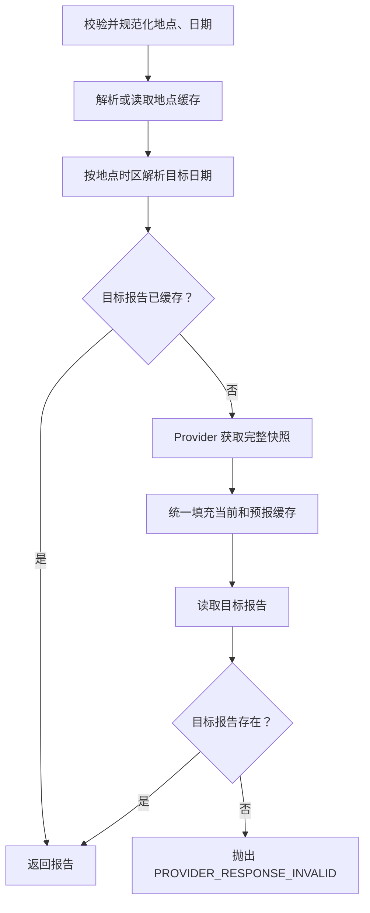

# 天气模块保守精简设计

> 状态：待用户复核  
> 日期：2026-07-27  
> 范围：仅优化天气模块的结构和重复代码，不改变业务能力  
> 前置设计：`2026-07-23-weather-module-target-architecture-design.md`

## 1. 背景

天气模块目标架构已经落地为：

```text
WeatherController / WeatherTool
              ↓
        WeatherService
              ↓
        WeatherProvider
              ↓
  OpenMeteoWeatherProvider
```

该分层能够隔离 REST、AI Tool、业务逻辑和外部供应商协议，应当保留。

当前天气模块共有约 20 个生产代码文件、1056 行代码。主要代码集中在：

- `OpenMeteoWeatherProvider`：约 313 行。
- `WeatherService`：约 246 行。
- `WeatherController`：约 128 行。

其余文件大多是十几行的 record、enum、异常或配置类。当前问题不是分层过多，而是：

1. 多个只在单一入口使用的小型顶层 DTO 增加目录噪声。
2. `WeatherService` 的当前天气和预报分支重复构造报告、遍历预报并填充缓存。
3. 仅由一个父类型使用的枚举独立占用顶层文件。
4. 两参数查询对象对当前规模的模块收益有限。
5. 部分注释逐行复述代码，增加阅读量但没有增加约束信息。

## 2. 目标

本次精简目标：

- 保留 `Controller/Tool → Service → Provider` 边界。
- 保留 Open-Meteo HTTP 和 JSON 细节只存在于 Provider。
- 保留结构化领域结果和类型化天气异常。
- 保持 REST 请求与响应 JSON 兼容。
- 保持 AI Tool 的参数、状态及行为兼容。
- 保持缓存 TTL、查询范围和外部请求次数不变。
- 将顶层生产文件从约 20 个减少到约 14 个。
- 将生产代码从约 1056 行减少到约 820～900 行。
- 不引入新的框架、缓存服务、供应商策略或抽象层。

代码行目标是指导值，不能通过删除必要校验、测试接口或安全日志达成。

## 3. 非目标

本次不包含：

- 删除 `WeatherProvider`。
- 将天气模块拆成微服务。
- 引入 Redis、重试框架、熔断器或异步批量框架。
- 更换 Open-Meteo。
- 增加空气质量、预警、生活指数等功能。
- 修改 REST JSON 字段或 AI Tool 协议。
- 修复所有已知天气业务缺陷。
- 修改天气模块之外的 Bot、语音、图片或记忆代码。

观测时间解析、今日降雨数据完整性、HTTP 状态码等问题应作为独立缺陷处理，每项先添加回归测试，不与结构精简混合实施。

## 4. 方案比较

### 4.1 方案 A：只合并文件

将 DTO 和枚举改为嵌套类型，业务逻辑不变。

优点：

- 修改风险最低。
- 顶层文件数量明显下降。

缺点：

- 实际语义类型数量基本不变。
- `WeatherService` 重复逻辑仍然存在。
- 总代码量下降有限。

### 4.2 方案 B：合并局部类型并消除重复逻辑

在方案 A 基础上，统一 `WeatherService` 的快照缓存填充过程，并精简 Provider 内部的重复解析步骤。

优点：

- 保持架构边界。
- 文件数量和代码量都有真实下降。
- 核心流程更容易阅读和测试。

缺点：

- 测试引用的类型位置需要同步更新。
- 需要重点验证缓存行为没有变化。

本设计采用方案 B。

### 4.3 方案 C：删除 Provider 抽象

由 `WeatherService` 直接调用 Open-Meteo。

优点：

- 文件和接口数量最少。

缺点：

- 业务逻辑重新耦合 HTTP 与供应商 JSON。
- `WeatherService` 单元测试需要了解网络协议。
- 与已确认的天气目标架构冲突。

本设计不采用方案 C。

## 5. 目标文件结构

```text
controller/
└── WeatherController.java

Service/tool/
├── WeatherTool.java
└── WeatherToolResult.java

Service/weather/
├── WeatherService.java
├── WeatherProvider.java
├── OpenMeteoWeatherProvider.java
├── WeatherProperties.java
├── WeatherConfiguration.java
├── WeatherReport.java
├── WeatherLocation.java
├── WeatherSnapshot.java
├── CurrentConditions.java
├── DailyForecast.java
└── WeatherException.java
```

预计保留 14 个顶层生产文件。

以下领域类型继续独立存在：

- `WeatherLocation`
- `WeatherSnapshot`
- `CurrentConditions`
- `DailyForecast`

它们分别表达地点、供应商快照、实时观测和逐日预报。将它们合并为带大量空字段的通用对象会降低类型安全和可读性。

## 6. 类型精简

### 6.1 删除 WeatherQuery

当前入口：

```java
weatherService.query(new WeatherQuery(city, date));
```

目标入口：

```java
weatherService.query(city, date);
```

`WeatherService` 内部统一执行：

- 城市非空校验。
- 城市和日期首尾空格清理。
- 空日期归一化。

这样可以删除 `WeatherQuery.java`，同时避免 Controller 和 Tool 都构造只有两个字符串的对象。

### 6.2 WeatherError 成为 WeatherException 的嵌套枚举

目标形式：

```java
public final class WeatherException extends RuntimeException {
    public enum Error {
        LOCATION_REQUIRED,
        LOCATION_AMBIGUOUS,
        LOCATION_NOT_FOUND,
        INVALID_DATE,
        PROVIDER_TIMEOUT,
        PROVIDER_UNAVAILABLE,
        PROVIDER_RESPONSE_INVALID
    }
}
```

错误分类和值保持不变，只删除独立的 `WeatherError.java` 顶层文件。

领域异常不得直接依赖 `ResponseCodeEnum` 或 `WeatherToolResult.Status`，以免业务层依赖 REST 或 AI 适配层。

### 6.3 WeatherReportType 成为 WeatherReport 的嵌套枚举

目标引用：

```java
WeatherReport.Type.CURRENT
WeatherReport.Type.FORECAST
```

JSON 中的 `type` 值仍保持 `CURRENT` 或 `FORECAST`。

### 6.4 批量 REST DTO 成为 WeatherController 的嵌套 record

以下三个 DTO：

- `WeatherBatchRequest`
- `WeatherBatchItem`
- `WeatherBatchResponse`

只由天气 REST 入口使用，目标是成为 `WeatherController` 的公开嵌套 record：

```java
public record BatchRequest(List<String> cities, String date) {}

public record BatchItem(
        String city,
        boolean success,
        WeatherReport data,
        String errorCode,
        String errorMessage) {}

public record BatchResponse(
        int total,
        int successCount,
        int failureCount,
        List<BatchItem> items) {}
```

Jackson 字段名、请求体和响应体保持兼容。嵌套类型仍是实际 Java 类型，本项主要减少顶层文件和目录噪声，不应被描述为消除了三个语义对象。

### 6.5 保留 WeatherToolResult

`WeatherToolResult` 是 AI Tool 的稳定协议，不与 REST 批量结果合并。

原因：

- AI Tool 使用机器可判定的状态。
- REST 批量结果还需要城市、业务错误码和单项成功标记。
- 强行复用会让 REST 和 AI 协议相互耦合。

## 7. WeatherService 精简

### 7.1 当前重复

当前查询分为当前天气和未来预报两个大分支。两个分支均可能执行：

```text
provider.fetch()
→ 构造当前报告
→ 遍历逐日预报
→ 构造预报报告
→ 填充 currentCache
→ 填充 forecastCache
```

### 7.2 目标流程



目标公开方法：

```java
public WeatherReport query(String location, String dateExpression)
```

建议保留的私有方法：

```text
normalizeQuery()
resolveLocation()
resolveDate()
findCachedReport()
populateCaches()
requireCachedReport()
normalizeLocationKey()
buildCacheKey()
```

其中 `populateCaches()` 是唯一负责把 `WeatherSnapshot` 转换并写入缓存的方法。

### 7.3 缓存行为约束

重构前后必须保持：

- 地点缓存按规范化用户输入键控。
- 当前天气使用 `currentCacheTtl`。
- 未来预报使用 `forecastCacheTtl`。
- 相同地点、相同日期的缓存命中不调用 `provider.fetch()`。
- 一次 Provider 快照能够同时填充当前天气和可用逐日预报。
- 目标日期缺失时抛出 `PROVIDER_RESPONSE_INVALID`。
- 每套缓存继续受 `maxCacheEntries` 限制。

本次不处理并发冷缓存击穿，避免扩大范围。

## 8. OpenMeteoWeatherProvider 精简

Provider 继续集中负责：

- 地理编码 HTTP 请求。
- 天气 HTTP 请求。
- HTTP 错误转换。
- JSON 完整性校验。
- Open-Meteo 字段到领域对象的转换。

不新增 `GeocodingClient`、`ForecastClient`、`WeatherJsonParser` 等类。

允许的内部精简：

- 将观测时间解析收敛为单个私有方法。
- 将每日数组完整性校验收敛为单个私有方法。
- 合并重复的耗时计算和错误转换。
- 删除只复述下一行代码的注释。

不得删除：

- 必填字段校验。
- 数组长度一致性校验。
- 超时与网络异常分类。
- 响应正文不写入日志的安全约束。

## 9. 错误处理

保留两个适配层映射：

```text
WeatherException.Error
├── GlobalExpectionHandler → REST 业务错误码
└── WeatherTool → AI Tool 状态
```

不新增统一 `WeatherErrorMapper`，因为它只会为了消除两个小型 `switch` 增加新的类。

不把 REST 和 Tool 状态放入领域枚举，避免领域层依赖适配层。

批量 REST 查询继续把 `WeatherException` 转换为单项失败；未预期异常继续交给全局异常处理器，不在批量循环中静默吞掉。

## 10. 数据流兼容性

### 10.1 REST

以下接口保持不变：

```text
GET  /api/weather
GET  /api/weather/{city}
POST /api/weather/batch
```

请求参数、JSON 字段、成功业务码和单项错误码保持兼容。

### 10.2 AI Tool

工具功能、参数含义和结果状态保持不变：

```text
location
date
SUCCESS
LOCATION_REQUIRED
LOCATION_AMBIGUOUS
LOCATION_NOT_FOUND
INVALID_DATE
PROVIDER_TIMEOUT
PROVIDER_UNAVAILABLE
```

系统提示词中的工具名称不一致属于独立缺陷，不混入本次纯结构精简。

### 10.3 Provider

`WeatherProvider` 继续定义：

```java
WeatherLocation resolveLocation(String requestedLocation);
WeatherSnapshot fetch(WeatherLocation location);
```

`WeatherService` 不得引用任何 Open-Meteo JSON 字段名称。

## 11. 测试策略

精简必须先通过现有测试编译基线修复或使用可独立执行的测试配置。结构重构不得在测试无法运行的情况下完成。

重点回归：

### WeatherService

- 空地点仍产生 `LOCATION_REQUIRED`。
- 空日期和“今天”返回当前报告。
- “明天”“后天”和 ISO 日期返回相同目标预报。
- 过去和三天后的日期被拒绝。
- 相同当前查询只调用一次 `provider.fetch()`。
- 第一次当前查询后，明天查询命中预报缓存。
- 第一次预报查询后，当前查询命中当前缓存。
- Provider 快照缺少目标日期时产生 `PROVIDER_RESPONSE_INVALID`。

### WeatherController

- 三个接口路径不变。
- 单城市 JSON 不变。
- 批量请求 JSON 不变。
- 批量混合成功/失败 JSON 不变。
- 批量数量限制不变。

### WeatherTool

- Tool 注解存在。
- `location` 必填、`date` 可选。
- 成功结果和所有错误状态映射不变。

### OpenMeteoWeatherProvider

- 地理编码字段映射不变。
- 当前天气和每日预报映射不变。
- 429、5xx、超时、网络错误和损坏 JSON 分类不变。
- 日志不包含响应正文、完整 URL 或密钥。

## 12. 实施顺序

为降低一次性改动范围，按以下顺序实施：

1. 添加或更新行为兼容测试，确认当前基线。
2. 精简 `WeatherService` 的快照到缓存流程。
3. 删除 `WeatherQuery`，将校验迁入 `WeatherService`。
4. 合并 `WeatherError` 和 `WeatherReportType`。
5. 将批量 DTO 收拢到 `WeatherController`。
6. 精简 Provider 内部重复代码和注释。
7. 运行天气单元测试、Controller 测试和完整测试。
8. 对比 REST JSON 与 Tool Schema，确认兼容。

每一步应保持可编译、可测试，避免一次删除全部类型后再集中修复引用。

## 13. 风险与控制

| 风险 | 控制方式 |
|---|---|
| 缓存重构改变请求次数 | 使用 Provider 调用计数测试 |
| 嵌套 DTO 改变 JSON | 使用 MockMvc 快照式字段断言 |
| 嵌套枚举改变序列化值 | 明确断言 `CURRENT`、`FORECAST` |
| 删除 WeatherQuery 后漏掉校验 | 参数化覆盖 null、空白和首尾空格 |
| 测试批量更新导致行为回归被掩盖 | 先增加行为断言，再移动类型 |
| 为减少行数删除必要校验 | Provider 异常和数据完整性测试必须保留 |

## 14. 验收标准

- 顶层天气生产文件约为 14 个。
- 生产代码约为 820～900 行；若保留必要校验导致略高，不以删校验换取指标。
- `Controller/Tool → Service → Provider` 依赖方向不变。
- `WeatherProvider` 接口保留。
- REST 路径、请求字段和响应字段兼容。
- AI Tool 参数及状态兼容。
- 当前天气、预报、日期范围和缓存行为兼容。
- Open-Meteo HTTP 与 JSON 细节仍只存在于 Provider。
- 没有新增天气框架、供应商或基础设施。
- 天气相关测试通过。
- 完整项目测试通过，或明确列出与本次无关的既有失败。

## 15. 最终决策

- 采用保守精简方案 B。
- 保留模块化单体和三层核心结构。
- 删除无必要的顶层包装类，但不合并有独立业务含义的领域模型。
- 优先消除 `WeatherService` 重复流程，而不是只追求目录中的文件数量。
- 不通过 `Map<String, Object>`、通用可空 DTO 或删除校验来减少类和代码。
- 本设计只定义结构优化，不授权直接修改生产代码。
