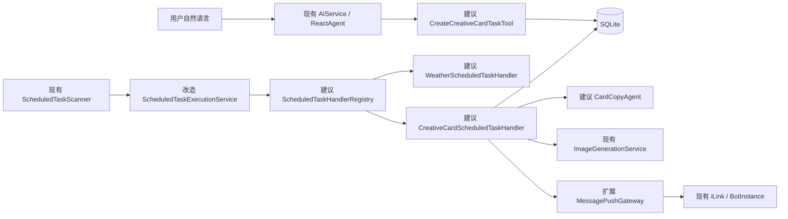

# 周期性图文卡片推送设计

## 1. 背景

项目已经初步实现周期天气推送：

`ReactAgent`
→ 周期任务 Tool
→ SQLite
→ `ScheduledTaskScanner`
→ `ScheduledTaskExecutionService`
→ 内容生成
→ iLink 文本推送。

当前实现仍以天气任务为中心：

- `ScheduledTask` 包含 `location`、`localTime` 等天气/每日调度字段。
- `ScheduledTaskExecutionService` 直接依赖 `WeatherService` 和天气内容组件。
- `MessagePushGateway` 只提供文本推送。
- `ImageGenerationTool` 使用 `ThreadLocal` 把图片交回当前对话线程，不适合后台调度 worker。

本设计扩展一种新的周期内容任务：用户通过自然语言创建自定义主题的图文卡片任务，系统按受限调度规则生成图片和独立文案，通过微信推送，并利用近期创作历史避免重复。

## 2. 已确认产品决策

- 内容类型：用户自定义主题的图文卡片。
- 输出形式：一张图片加一条独立、可复制的文案。
- 创作策略：主题约束加近期历史去重。
- 调度能力：支持自定义周期，但不接受用户或模型直接提交任意 Cron。
- 规则来源：Agent 从自然语言提取结构化规则，由服务端校验和计算。
- 架构方式：现有调度核心增加按任务类型注册的 Handler。
- MVP 发送范围：沿用现有默认 Bot 约束，不扩展多 Bot 精确路由。

## 3. 目标与非目标

### 3.1 目标

用户可以表达：

> 每周一三五早上八点，生成一张治愈系早安卡片发给我。

系统应：

1. 由 Agent 识别图文卡片周期任务意图。
2. 创建带有主题和结构化调度规则的持久任务。
3. 到期后读取该任务最近的创作历史。
4. 生成结构化文案草稿和绘图提示词。
5. 检测近期重复，必要时有限重写。
6. 调用现有文生图 Service。
7. 先发送图片，再发送独立文案。
8. 分阶段记录发送结果，重试时避免重复图片或文案。

### 3.2 非目标

第一版不实现：

- 任意原始 Cron 输入。
- 可视化工作流编排器。
- 多 Bot 精确路由。
- 视频生成。
- 多图轮播。
- 自动联网搜索素材。
- 向量化创作历史。
- 用户自选模型、采样参数和任意图片尺寸。

## 4. 方案选择

### 4.1 备选方案

#### 方案 A：在现有执行器增加任务类型分支

优点是改动少。缺点是天气、图文、语音、搜索摘要和邮件任务会不断向同一执行器添加条件分支，难以独立测试和演进。

#### 方案 B：任务类型 Handler Registry

保留统一的扫描、执行记录、抢占、重试和恢复机制；每种任务类型实现独立 Handler。天气逻辑先迁移到天气 Handler，图文卡片使用新的创作 Handler。

这是选定方案。

#### 方案 C：通用内容工作流引擎

把搜索、写作、图片、语音和发送抽象成任意组合节点。扩展能力强，但需要工作流描述、节点状态、补偿和复杂恢复，超出当前目标。

## 5. 总体架构



### 5.1 调度核心

建议新增：

- `ScheduledTaskHandler`：定义一种任务类型的单次执行。
- `ScheduledTaskHandlerRegistry`：按 `taskType` 返回 Handler。
- `WeatherScheduledTaskHandler`：承接当前天气查询、天气文案和文本发送。
- `CreativeCardScheduledTaskHandler`：编排图文生成、去重和分阶段推送。

`ScheduledTaskExecutionService` 只保留公共流程：

1. 抢占执行记录。
2. 读取任务。
3. 检查任务状态。
4. 从 Registry 获取 Handler。
5. 调用 Handler。
6. 根据结构化结果更新成功、降级、重试或失败状态。

它不再直接依赖 `WeatherService`、天气内容 Agent 或天气模板。

### 5.2 图文卡片模块

建议包：

`com.demo.demo.Service.scheduling.creative`

建议组件：

| 组件 | 职责 |
|---|---|
| `CreateCreativeCardTaskTool` | 接收主题、风格和结构化调度参数 |
| `CreateCreativeCardTaskCommand` | Tool 到 Service 的可信命令 |
| `CreativeCardTaskPayload` | 解析、校验任务 payload |
| `CreativeCardScheduledTaskHandler` | 单次图文任务编排 |
| `CardCopyAgent` | 根据主题和历史生成结构化草稿 |
| `CreativeCardDraft` | 标题、文案、图片提示词和关键词 |
| `CreativeCardSimilarityService` | 检测近期标题、关键词和 prompt 相似度 |
| `CreativeCardHistoryRepository` | 保存和读取有限创作历史 |
| `CreativeCardDeliveryService` | 图片生成及图片、文案分阶段发送 |

## 6. 数据设计

### 6.1 通用任务表

当前 `scheduled_task.location` 和 `local_time` 是必填字段，不能使用空字符串或虚假值兼容图文任务。

建议将任务表迁移为：

| 字段 | 含义 |
|---|---|
| `task_id` | 公开任务 ID |
| `owner_target_id` | 微信推送目标 |
| `task_type` | `DAILY_WEATHER`、`CREATIVE_CARD` |
| `status` | `ACTIVE`、`PAUSED`、`CANCELED` |
| `schedule_kind` | `ONCE`、`DAILY`、`WEEKLY`、`MONTHLY`、`INTERVAL` |
| `schedule_expression` | 服务端生成并校验的结构化规则 JSON |
| `time_zone` | IANA 时区 |
| `payload` | 任务类型专属 JSON |
| `next_run_at` | 下一次 UTC 执行时间 |
| `version` | 乐观锁版本 |
| `created_at`、`updated_at` | 审计时间 |

SQLite 迁移采用：

1. 创建新结构表。
2. 把现有天气任务的 `location` 写入天气 payload。
3. 把 `local_time` 转成 `DAILY` 规则。
4. 保留任务 ID、owner、状态、版本和下一次执行时间。
5. 校验行数和关键字段。
6. 切换表名。

不得使用虚假城市、虚假时间或空字符串作为长期兼容方案。

### 6.2 图文卡片 payload

```text
theme
visualStyle
audience
language
copyTone
imageRatio
historyWindow
```

默认值：

- `audience`：本人。
- `language`：`zh-CN`。
- `historyWindow`：最近 20 次。
- 图片比例：从系统允许集合中选择。

第一版不向用户开放模型名称、采样参数或任意尺寸。

### 6.3 创作历史表

建议新增 `creative_card_history`：

| 字段 | 用途 |
|---|---|
| `task_id`、`execution_id` | 关联任务和执行 |
| `title` | 历史标题 |
| `copy_fingerprint` | 文案归一化指纹 |
| `prompt_fingerprint` | 绘图提示词指纹 |
| `keywords` | 近期主题避重 |
| `image_status` | 图片生成/发送阶段 |
| `text_status` | 文案发送阶段 |
| `created_at` | 历史排序 |

历史严格按 task ID 查询，不跨用户、任务或主题共享。每个任务只保留最近 20 至 30 条。

## 7. 自然语言调度

模型不生成 Cron 字符串，只提取结构化字段。

示例：

```text
输入：每周一三五早上八点
kind: WEEKLY
daysOfWeek: [MONDAY, WEDNESDAY, FRIDAY]
localTime: 08:00
zoneId: Asia/Shanghai
```

建议第一版支持：

- 指定时间执行一次。
- 每天。
- 每周指定星期。
- 每月指定日期。
- 每隔 N 小时或 N 天。
- 工作日。

由建议类 `RecurrenceCalculator` 根据受校验的 `ScheduleRule` 计算 `nextRunAt`。

约束：

- 最短执行间隔为 1 小时。
- 每个用户限制活动任务数量。
- 图文任务设置每日执行次数上限。
- 每月指定日期不存在时跳过当月。
- 所有本地时间同时保存 IANA 时区。
- DST 间隙和重叠必须有确定规则和测试。

## 8. 内容生成与去重

### 8.1 Agent 输出

`CardCopyAgent` 使用独立、无副作用的 Agent，不使用普通聊天记忆，也不注册邮件、图片或其他副作用 Tool。

输出契约：

```text
CreativeCardDraft
├── title
├── copy
├── imagePrompt
├── keywords
└── contentSafetyNote
```

要求：

- 内容围绕用户主题。
- `imagePrompt` 描述画面，不要求图片模型生成中文正文。
- 文案设置长度上限。
- Agent 不接触用户身份、target ID、contextToken 或调度内部状态。
- 输出解析失败最多重新生成一次。

### 8.2 去重

第一版使用轻量、可测试的本地规则：

- 归一化标题精确比较。
- 近期关键词重合率。
- 绘图提示词的分词/Jaccard 相似度。
- 超过阈值时，把冲突标题和关键词反馈给 Agent 重写。
- 最多重写两次。

不复用 `VectorMemoryStore`。现有向量存储属于用户对话记忆，混入创作历史会造成隔离和生命周期不清。

### 8.3 图片生成

后台任务直接调用：

`ImageGenerationService.generateImage(imagePrompt)`

不调用 `ImageGenerationTool.generateImage()`，因为该 Tool 依赖 `ThreadLocal` 把二进制交回当前聊天线程。

图片生成前校验：

- prompt 非空和长度。
- 图片比例属于允许集合。
- 用户主题和最终 prompt 满足内容安全限制。

## 9. 推送与幂等

扩展 `MessagePushGateway`：

```text
pushText(targetId, text)
pushImage(targetId, imageBytes)
```

不定义模糊的 `push(Object content)`。

发送顺序：

1. 生成并保存确定的内容草稿。
2. 生成图片。
3. 发送图片。
4. 发送独立文案。
5. 标记成功并保存历史结果。

建议阶段：

```text
CONTENT_GENERATED
IMAGE_GENERATED
IMAGE_SENT
TEXT_SENT
SUCCEEDED
DEGRADED
FAILED
```

重试规则：

- 图片已发送、文字失败：只重试文字。
- 图片生成临时失败：有限重试图片生成。
- 图片最终失败：发送一次纯文案并标记 `DEGRADED`。
- 图片发送失败：先重试图片，不提前发送文案。
- 文案已发送后不得重新执行整个任务。
- 每个阶段与唯一 `execution_id` 绑定。

iLink 没有业务幂等键时，发送成功但响应未知仍存在无法完全消除的重复窗口；此情况应记录明确错误状态，禁止无上限重试。

## 10. 错误处理与安全

- 任务 payload 无法解析：永久失败，不重试。
- Agent 临时超时：有限重试。
- Agent 输出非法：重新生成一次，仍失败则终止。
- 图片服务限流或暂时不可用：退避重试。
- 图片内容违规：永久失败，向用户发送安全提示与否由产品策略决定。
- iLink 离线：按现有有限重试策略处理。
- contextToken 失效：永久失败，等待用户下一次入站消息刷新。
- 日志不得记录 contextToken、完整用户主题、完整文案、绘图 prompt 或外部响应正文。
- 创作历史按任务隔离并设置保留上限。

## 11. 测试策略

### 11.1 调度回归

- 天气逻辑迁移到 Handler 后行为保持不变。
- 未知 `taskType` 不执行、不无限重试。
- 相同执行记录只被一个 worker 抢占。

### 11.2 调度规则

- 一次、每日、每周、每月、间隔和工作日。
- 时区、DST 间隙和重叠。
- 月末不存在日期。
- 跨月、跨年。
- 最短间隔和每日次数限制。

### 11.3 创作

- 不同用户和任务历史隔离。
- 相似标题、关键词和 prompt 触发重写。
- 重写最多两次。
- Agent 非法输出和空输出。
- 图片生成参数校验。

### 11.4 推送

- 图片成功后文案成功。
- 图片生成失败后纯文案降级。
- 图片已发送、文案失败时只重试文案。
- 已完成阶段不会重复发送。
- iLink、模型和图片服务全部 mock，CI 不调用外部网络。

### 11.5 集成验证

自动化链路：

`自然语言`
→ Tool
→ SQLite
→ 到期扫描
→ Handler Registry
→ 创作草稿
→ 图片生成 mock
→ 图片和文本 gateway mock
→ 历史记录。

发布前使用测试微信账号对默认 Bot 执行一次真机图片加文案推送。

## 12. 实施顺序

1. 把天气执行逻辑提取为 `WeatherScheduledTaskHandler`，保持行为不变。
2. 引入 `ScheduledTaskHandlerRegistry`。
3. 建立通用 `ScheduleRule`、`RecurrenceCalculator` 和 SQLite 迁移。
4. 实现图文卡片任务 Tool、command 和 payload。
5. 实现 `CardCopyAgent` 和历史去重。
6. 直接接入 `ImageGenerationService`。
7. 扩展图片推送 Gateway。
8. 实现分阶段发送、降级和重试。
9. 增加端到端测试和真机验收。

每一步应独立测试、独立检查 diff，并形成一个聚焦的 Git 提交；不得提前实现后续步骤。

## 13. 验收标准

- 用户可通过自然语言创建自定义主题图文卡片任务。
- 用户不能通过模型参数伪造 owner、target 或 contextToken。
- 支持已定义的结构化自定义周期，不接受原始 Cron。
- 到期后生成一张图片和一条独立文案。
- 近期相似内容会有限重写。
- 图片失败可降级为一次纯文案。
- 阶段重试不会重复已成功发送的内容。
- 现有天气周期任务保持可用。
- 所有自动化测试不访问真实模型、文生图或 iLink。
- 日志和数据库不泄露明文 contextToken。
