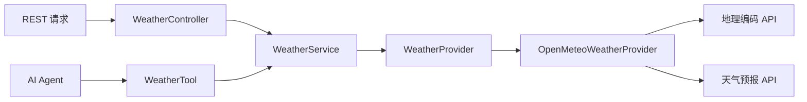
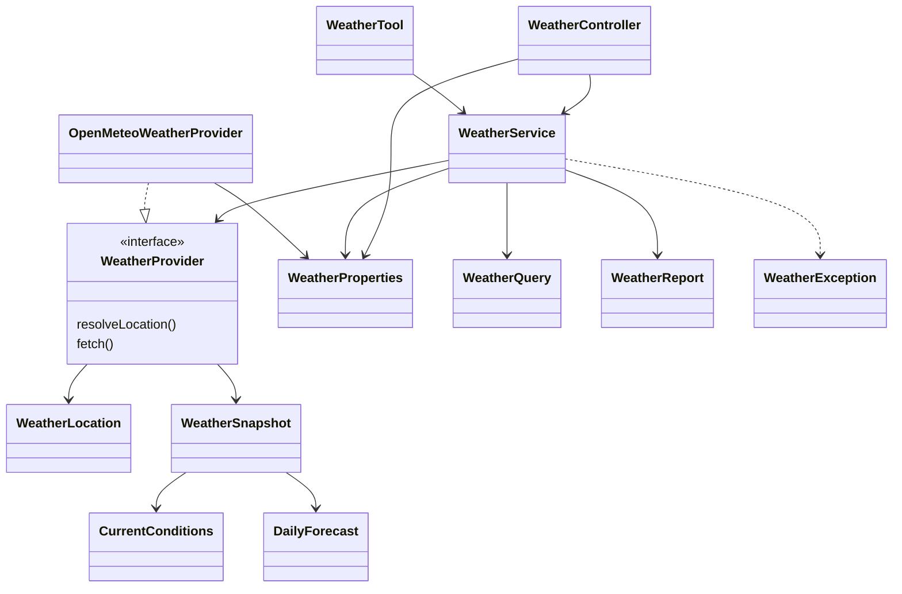
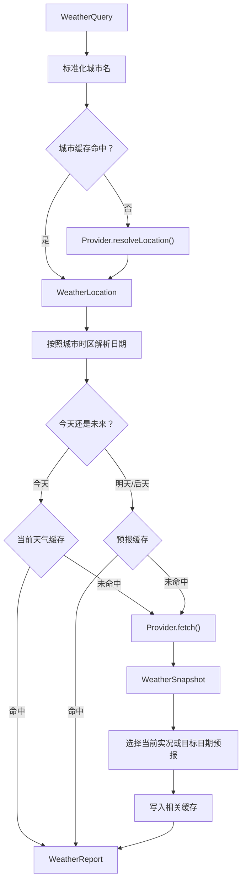

# 天气模块详细分析

> 分析范围：仅包含天气模块及其直接依赖，不涉及代码修改。  
> 项目路径：`E:\Summer-projects V3.1\xialingying`  
> 分析日期：2026-07-24

## 1. 模块定位

天气模块是一个相对独立的业务子模块，对外提供两种入口：

1. REST API：供浏览器、前端或其他系统调用。
2. AI Tool：供微信 AI Agent 自动调用。

两种入口最终共用同一个 `WeatherService`：



模块代码主要位于：

- `src/main/java/com/demo/demo/Service/weather/`
- `src/main/java/com/demo/demo/Service/tool/WeatherTool.java`
- `src/main/java/com/demo/demo/Service/tool/WeatherToolResult.java`
- `src/main/java/com/demo/demo/controller/WeatherController.java`
- `src/main/java/com/demo/demo/controller/dto/WeatherBatch*.java`

## 2. 目录结构

```text
天气模块
├── controller/
│   └── WeatherController.java
│
├── controller/dto/
│   ├── WeatherBatchRequest.java
│   ├── WeatherBatchResponse.java
│   └── WeatherBatchItem.java
│
├── Service/tool/
│   ├── WeatherTool.java
│   └── WeatherToolResult.java
│
├── Service/weather/
│   ├── WeatherService.java
│   ├── WeatherProvider.java
│   ├── OpenMeteoWeatherProvider.java
│   ├── WeatherConfiguration.java
│   ├── WeatherProperties.java
│   │
│   ├── WeatherQuery.java
│   ├── WeatherLocation.java
│   ├── WeatherSnapshot.java
│   ├── WeatherReport.java
│   ├── WeatherReportType.java
│   ├── CurrentConditions.java
│   ├── DailyForecast.java
│   │
│   ├── WeatherError.java
│   └── WeatherException.java
│
└── execption/
    ├── GlobalExpectionHandler.java
    └── ResponseCodeEnum.java
```

可以按四层理解：

| 层次 | 代码 | 作用 |
|---|---|---|
| 接入层 | `WeatherController`、`WeatherTool` | 接收 REST 或 AI 请求 |
| 业务层 | `WeatherService` | 日期解析、缓存、业务编排 |
| 外部适配层 | `WeatherProvider`、`OpenMeteoWeatherProvider` | 调用外部天气服务 |
| 数据模型层 | `WeatherReport` 等 record | 表达查询、地点和天气数据 |

## 3. 核心类关系



## 4. WeatherController：REST 接入层

文件：`src/main/java/com/demo/demo/controller/WeatherController.java`

它只负责：

- 接收请求参数。
- 校验批量请求。
- 构造 `WeatherQuery`。
- 调用 `WeatherService`。
- 包装响应。
- 对批量结果做成功/失败汇总。

### 4.1 单城市查询

Query 参数形式：

```http
GET /api/weather?city=杭州
GET /api/weather?city=杭州&date=明天
```

执行关系：

```text
city + date
→ new WeatherQuery(city, date)
→ weatherService.query()
→ Response.success(report)
```

Path 参数形式：

```http
GET /api/weather/杭州
GET /api/weather/杭州?date=后天
```

Path 形式内部仍然调用 `getWeather()`，没有复制天气业务逻辑。

### 4.2 批量查询

```http
POST /api/weather/batch
Content-Type: application/json
```

请求示例：

```json
{
  "cities": ["杭州", "北京", "上海"],
  "date": "明天"
}
```

处理过程：

```text
校验 cities
→ 校验数量不超过 batchLimit
→ 逐个城市调用 WeatherService
→ 单个城市失败时保留错误
→ 汇总成功和失败数量
```

批量查询支持部分成功，不会因为一个城市不存在而丢弃其他城市的成功结果。默认最多查询 10 个城市。

## 5. WeatherTool：AI Agent 接入层

文件：`src/main/java/com/demo/demo/Service/tool/WeatherTool.java`

它使用 Spring AI 的 `@Tool` 注解，将天气能力注册给大模型。

真实工具方法：

```java
queryWeather(String location, String date)
```

Agent 调用示例：

```text
用户：杭州明天会不会下雨？

Agent 提取参数：
location = 杭州
date = 明天

→ WeatherTool.queryWeather()
→ WeatherService.query()
→ WeatherToolResult
→ Agent 生成中文答案
```

工具描述要求：

- 用户询问温度、冷热、降雨、是否带伞时调用。
- 用户没有提供地点时不要猜测。
- 缺少地点时应先向用户追问。

### 5.1 WeatherToolResult

成功结果：

```json
{
  "status": "SUCCESS",
  "message": "天气查询成功",
  "data": {
    "type": "FORECAST"
  }
}
```

失败结果：

```json
{
  "status": "LOCATION_NOT_FOUND",
  "message": "未找到城市",
  "data": null
}
```

这种结构让 Agent 可以根据稳定状态处理错误，而不需要解析自然语言错误文本。

## 6. WeatherService：业务核心

文件：`src/main/java/com/demo/demo/Service/weather/WeatherService.java`

`WeatherService` 是天气模块的核心类，负责：

1. 城市名称标准化。
2. 城市地理信息解析。
3. 日期表达式解析。
4. 天气缓存管理。
5. 调用 Provider 并选择返回数据。

### 6.1 完整处理过程



### 6.2 业务层边界

`WeatherService` 只依赖 `WeatherProvider` 接口，不直接依赖 Open-Meteo：

```java
private final WeatherProvider provider;
```

因此更换天气供应商时，Controller、Tool 和主要业务流程理论上不需要变化。

## 7. WeatherProvider：外部服务抽象

文件：`src/main/java/com/demo/demo/Service/weather/WeatherProvider.java`

接口包含两个方法：

```java
WeatherLocation resolveLocation(String requestedLocation);

WeatherSnapshot fetch(WeatherLocation location);
```

外部天气访问被拆成两个阶段：

### 7.1 解析地点

```text
杭州
→ 经度 120.1551
→ 纬度 30.2741
→ 时区 Asia/Shanghai
```

### 7.2 查询天气

```text
经纬度 + 时区
→ 当前天气
→ 今天、明天、后天天气
```

## 8. OpenMeteoWeatherProvider：外部 API 实现

文件：`src/main/java/com/demo/demo/Service/weather/OpenMeteoWeatherProvider.java`

这是当前唯一的 `WeatherProvider` 实现，负责所有 HTTP 请求和 JSON 解析。

### 8.1 地理编码接口

默认地址：

```text
https://geocoding-api.open-meteo.com/v1/search
```

请求参数：

```text
name=杭州
count=5
language=zh
format=json
```

返回后提取：

- 标准城市名。
- 省份或行政区。
- 国家。
- 纬度。
- 经度。
- 时区。

最终生成 `WeatherLocation`。

### 8.2 天气接口

默认地址：

```text
https://api.open-meteo.com/v1/forecast
```

请求数据包括：

```text
current:
- temperature_2m
- relative_humidity_2m
- apparent_temperature
- weather_code
- wind_speed_10m
- wind_direction_10m

daily:
- weather_code
- temperature_2m_max
- temperature_2m_min
- precipitation_probability_max
```

查询天数固定为：

```text
forecast_days=3
```

Open-Meteo 当前不需要 API Key。

## 9. 天气数据模型

### 9.1 WeatherQuery

表示原始查询：

```java
WeatherQuery(
    location,
    dateExpression
)
```

构造时会：

- 拒绝空城市。
- 去除城市首尾空格。
- 将空日期转换为空字符串。

### 9.2 WeatherLocation

表示解析后的城市：

```java
WeatherLocation(
    requestedName,
    name,
    adminArea,
    country,
    latitude,
    longitude,
    zoneId
)
```

同时保留用户输入名、供应商标准名、行政区、国家、经纬度和时区。

### 9.3 WeatherSnapshot

表示 Provider 返回的一次完整数据：

```java
WeatherSnapshot(
    location,
    observedAt,
    current,
    dailyForecasts,
    source
)
```

它包含当前实况和三日预报，是外部适配层与业务层之间的中间模型。

### 9.4 WeatherReport

表示最终交给 Controller 或 Agent 的结果：

```java
WeatherReport(
    type,
    location,
    targetDate,
    observedAt,
    current,
    forecast,
    source
)
```

查询今天时：

```text
type = CURRENT
current 有值
forecast 为空
```

查询明天或后天时：

```text
type = FORECAST
current 为空
forecast 有值
```

### 9.5 CurrentConditions

当前实况包含：

- 当前温度。
- 体感温度。
- 相对湿度。
- 风速。
- 风向。
- WMO 天气代码。

### 9.6 DailyForecast

每日预报包含：

- 日期。
- 最高温。
- 最低温。
- 天气代码。
- 最大降水概率。

## 10. 日期解析逻辑

天气模块支持：

| 输入 | 处理结果 |
|---|---|
| 空字符串 | 今天 |
| `今天` | 今天 |
| `明天` | 今天 + 1 天 |
| `后天` | 今天 + 2 天 |
| `yyyy-MM-dd` | 指定日期 |

它拒绝：

- 过去日期。
- 三天以后日期。
- 无效日期格式。

例如在 2026-07-24：

| 输入 | 结果 |
|---|---|
| 空 | 2026-07-24 |
| 今天 | 2026-07-24 |
| 明天 | 2026-07-25 |
| 后天 | 2026-07-26 |
| 2026-07-23 | 拒绝 |
| 2026-07-27 | 拒绝 |

日期按照查询城市的时区计算，而不是直接使用服务器时区。

当前不直接支持：

- “明日”
- “下周一”
- “这个周末”
- “7月25日”

AI Agent 有可能把自然语言归一化为工具支持的日期，但 REST 接口不会自动完成这种转换。

## 11. 缓存设计

`WeatherService` 内部维护三套 Caffeine 缓存：

```text
WeatherService
├── locationCache
├── currentCache
└── forecastCache
```

| 缓存 | 默认有效期 | 内容 |
|---|---:|---|
| `locationCache` | 24 小时 | 城市经纬度和时区 |
| `currentCache` | 10 分钟 | 当前天气 |
| `forecastCache` | 60 分钟 | 明天和后天预报 |

第一次查询杭州今天：

```text
地理编码请求
→ 天气请求
→ 缓存杭州地理信息
→ 缓存杭州当前天气
→ 同时缓存杭州明天、后天天气
```

随后查询杭州明天时，可以直接使用预报缓存。

缓存特点：

- 仅存在当前 JVM 内。
- 重启程序后消失。
- 多实例部署时不能共享。
- 当前项目阶段无需为此引入 Redis。

需要注意，配置说明中的“最大缓存数量 256”实际作用于每一套缓存，因此三套缓存的总条目理论上可接近 768。

当前天气和预报缓存使用“先查询、再请求、再写入”的方式。多个线程同时冷查询同一个城市时，可能重复调用外部 API。

## 12. 配置

配置类：`src/main/java/com/demo/demo/Service/weather/WeatherProperties.java`

配置前缀：

```yaml
weather:
```

支持的配置：

```yaml
weather:
  geocoding-base-url: https://geocoding-api.open-meteo.com/v1/search
  forecast-base-url: https://api.open-meteo.com/v1/forecast
  connect-timeout: 3s
  read-timeout: 5s
  location-cache-ttl: 24h
  current-cache-ttl: 10m
  forecast-cache-ttl: 60m
  max-cache-entries: 256
  batch-limit: 10
```

主配置没有显式提供时，会使用 `WeatherProperties` 中的默认值。

`WeatherConfiguration` 提供：

- 可注入的 `Clock`。
- 天气模块专用 `OkHttpClient`。

可注入 `Clock` 使日期相关测试具有确定性。

## 13. 异常体系

```text
WeatherException
└── WeatherError
    ├── LOCATION_REQUIRED
    ├── LOCATION_AMBIGUOUS
    ├── LOCATION_NOT_FOUND
    ├── INVALID_DATE
    ├── PROVIDER_TIMEOUT
    ├── PROVIDER_UNAVAILABLE
    └── PROVIDER_RESPONSE_INVALID
```

错误来源：

| 阶段 | 可能错误 |
|---|---|
| 构造查询 | 城市为空 |
| 地理编码 | 城市不存在、城市不明确 |
| 日期处理 | 格式无效、日期越界 |
| HTTP 请求 | 超时、服务不可用 |
| JSON 解析 | 供应商响应格式错误 |
| 预报选择 | 未找到目标日期 |

REST 入口通过全局异常处理器转换为业务错误码：

| WeatherError | 业务错误码 |
|---|---|
| `LOCATION_REQUIRED` | `40003` |
| `LOCATION_AMBIGUOUS` | `40006` |
| `LOCATION_NOT_FOUND` | `40004` |
| `INVALID_DATE` | `40007` |
| `PROVIDER_TIMEOUT` | `50301` |
| `PROVIDER_UNAVAILABLE` | `50302` |
| `PROVIDER_RESPONSE_INVALID` | `50002` |

AI Tool 则将这些错误转换为 `WeatherToolResult.Status`。

目前 `GlobalExpectionHandler` 对 `WeatherException` 使用 HTTP 200，因此城市不存在、日期错误或天气服务超时通常仍返回 HTTP 200，只在响应体中通过业务码表达失败。这会影响网关、HTTP 监控和标准客户端的错误处理。

## 14. 真实运行验证

现有日志已经确认以下链路真实成功：

```text
微信语音：“杭州今天的天气”
→ 微信提供语音识别文字
→ AIService
→ ReactAgent 选择 WeatherTool
→ WeatherService 解析杭州
→ Open-Meteo 地理编码成功
→ Open-Meteo 天气请求成功
→ AI 生成自然语言答案
→ 微信文本回复成功
```

日志中的耗时情况：

- 地理编码约 2.26 秒。
- 天气查询约 2.49 秒。
- 外部天气调用合计约 4.75 秒。
- 从收到微信消息到完成微信回复约 13.58 秒。

因此天气模块不是只有静态代码，AI Tool 到外部天气接口再到微信回复的端到端链路已经真实运行成功。

冷缓存响应相对较慢；缓存命中后的查询预计会明显加快，但现有日志尚不足以验证连续缓存命中的实际耗时。

## 15. 当前主要问题

### 15.1 P1：观测时间解析错误

Open-Meteo 返回的时间通常类似：

```text
2026-07-24T15:00
```

当前代码先按带时区偏移量的时间解析：

```java
ZonedDateTime.parse(currentTimeStr, ISO_OFFSET_DATE_TIME)
```

由于字符串没有 `+08:00` 等偏移量，这一步会失败。随后代码尝试：

```java
LocalDate.parse(currentTimeStr)
```

字符串包含时分，因此第二次解析也会失败，最终退化为：

```java
observedAt = Instant.now();
```

结果是 `observedAt` 很可能表示程序解析响应的时间，而不是天气数据的真实观测时间。

正确的解析思路应当是：

```text
LocalDateTime
→ 结合 WeatherLocation.zoneId
→ 转换为 Instant
```

这是从当前代码可以确认的缺陷。

### 15.2 P1：今日降雨和最高/最低温数据没有返回

Open-Meteo 返回的 `daily` 数据包含今天的：

- 最高温。
- 最低温。
- 最大降雨概率。

但用户查询“今天”时，`WeatherService` 只返回 `CurrentConditions`，并将 `forecast` 设为空。

因此以下问题的数据不完整：

```text
杭州今天会下雨吗？
今天要不要带伞？
今天最高温是多少？
```

今天的降雨概率和最高/最低温已经存在于 Provider 返回的快照中，但没有进入最终的当前天气报告。

### 15.3 P1：系统提示词与真实工具名不一致

`application.yml` 中的系统提示词要求：

```text
当用户问天气时使用 getWeather 工具
```

真实工具方法是：

```java
queryWeather
```

现有运行日志证明 Agent 仍然成功调用了天气工具，说明它能够根据工具描述完成匹配。但工具名不一致会增加模型选择错误的可能性。

### 15.4 P2：天气代码只有数字

当前结果类似：

```json
{
  "weatherCode": 61
}
```

没有提供：

```json
{
  "weatherDescription": "小雨"
}
```

最终需要依赖大模型解释 WMO 数字代码，存在误解风险。领域层提供稳定的中文或英文天气描述会更可靠。

### 15.5 P2：批量查询串行执行

批量接口使用普通 `for` 循环逐个查询城市。

一个冷缓存城市需要：

```text
地理编码请求 + 天气请求
```

杭州的真实外部调用约为 4.75 秒。10 个全部冷缓存的城市串行查询时，响应时间可能达到几十秒。

### 15.6 P2：城市歧义判断有限

Provider 只使用地理编码结果中的第一项，并通过名称、行政区和国家做有限歧义判断。

潜在情况：

- 第一项名称恰好完全匹配，但多个国家存在同名城市，可能不会报告歧义。
- 用户输入与供应商规范名不同，可能被过度判定为歧义。

### 15.7 P2：HTTP 错误状态不规范

城市不存在、日期错误、第三方超时等情况通常仍返回 HTTP 200，只通过响应体业务码表示失败。

合理的 HTTP 语义可以是：

- 输入错误：400。
- 城市不存在：404 或 422。
- 第三方数据异常：502。
- 第三方超时：503 或 504。
- 批量部分成功：200。

### 15.8 P3：缺少有限重试

以下短暂错误会直接导致查询失败：

- Open-Meteo 短暂 500。
- 连接瞬断。
- DNS 抖动。
- 偶发超时。

当前 MVP 不需要复杂熔断系统，但对安全 GET 请求进行一次受控重试会提高可用性。

### 15.9 P3：日志记录具体城市

Controller 会记录单城市名称和批量失败城市。城市信息可能属于用户位置隐私。

更保守的日志可以只记录：

- 请求类型。
- 批量数量。
- 成功和失败数量。
- 错误类型。
- 耗时。

## 16. 测试结构

天气模块已有以下测试：

| 测试 | 作用 |
|---|---|
| `WeatherDomainTest` | 领域对象和输入校验 |
| `WeatherServiceTest` | 日期解析、结果类型和缓存 |
| `OpenMeteoWeatherProviderTest` | HTTP、JSON、超时和异常 |
| `WeatherToolTest` | AI Tool 调用和错误映射 |
| `WeatherControllerTest` | REST 单城市和批量接口 |
| `WeatherAgentRoutingTest` | 微信天气问题是否进入 Agent |

已覆盖：

- 今天、明天和后天。
- ISO 日期。
- 过去日期和超范围日期。
- 当前天气和预报缓存。
- 地理编码解析。
- 天气 JSON 解析。
- HTTP 429、503、超时和损坏 JSON。
- Tool 状态映射。
- REST 单城市和批量接口。
- Agent 天气路由。

目前的问题：

1. 整个项目仍有其他测试编译错误，因此不能声称天气测试已经在完整构建中全部通过。
2. Provider 测试只断言 `observedAt` 非空，没有验证其准确值，所以未发现观测时间解析问题。
3. 缓存容量测试没有真正检查缓存条目数量，无法证明上限配置正确。

建议补充的验证场景：

- `observedAt` 的精确时间。
- 今天的降雨概率和最高/最低温。
- 同名城市歧义。
- 并发冷缓存查询。
- 缓存实际容量。
- 缓存命中后的真实耗时。

## 17. 完成度判断

| 能力 | 状态 |
|---|---|
| 单城市当前天气 | 已实现并真实验证 |
| 明天、后天天气 | 已实现 |
| REST API | 已实现 |
| AI Tool | 已实现并真实验证 |
| 批量查询 | 已实现 |
| 城市解析 | 已实现 |
| 城市时区处理 | 已实现 |
| 本地缓存 | 已实现 |
| 异常分类 | 已实现 |
| 今日降雨概率 | 最终数据不完整 |
| 观测时间 | 存在解析缺陷 |
| 人类可读天气描述 | 未实现 |
| 全项目测试通过基线 | 尚未建立 |

综合判断：

> 天气模块以 `WeatherService` 为核心，通过 `WeatherProvider` 隔离 Open-Meteo，同时为 REST API 和 AI Agent 提供服务。模块边界清晰，端到端链路已真实运行成功；当前主要不足集中在观测时间正确性、今日预报数据完整性、天气代码语义、批量性能和 HTTP 错误协议。

## 18. 推荐阅读顺序

建议按照以下顺序阅读天气代码：

```text
1. WeatherQuery
2. WeatherReport / CurrentConditions / DailyForecast
3. WeatherController
4. WeatherTool
5. WeatherService
6. WeatherProvider
7. OpenMeteoWeatherProvider
8. WeatherProperties / WeatherConfiguration
9. WeatherException / WeatherError
10. 对应测试
```

阅读时只需要记住主链：

```text
REST 或 AI Agent
→ WeatherController / WeatherTool
→ WeatherService
→ WeatherProvider
→ OpenMeteoWeatherProvider
→ Open-Meteo API
→ WeatherSnapshot
→ WeatherReport
```
